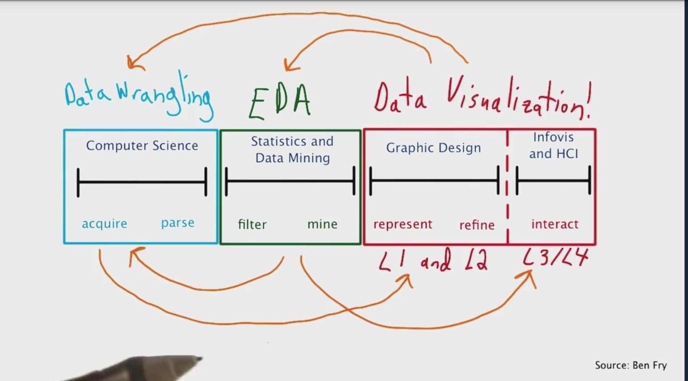
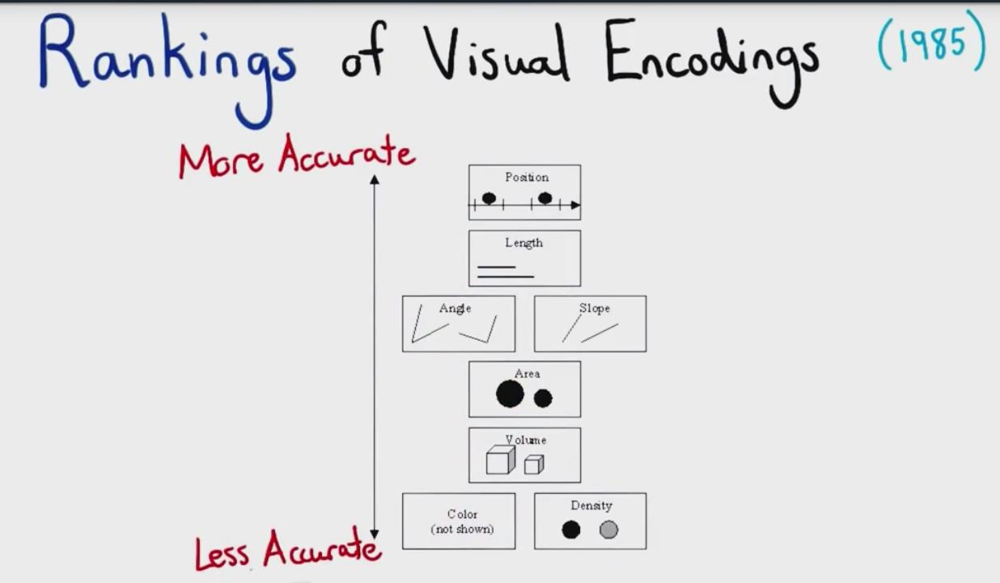
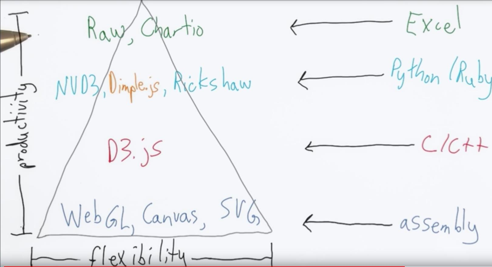
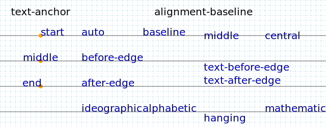
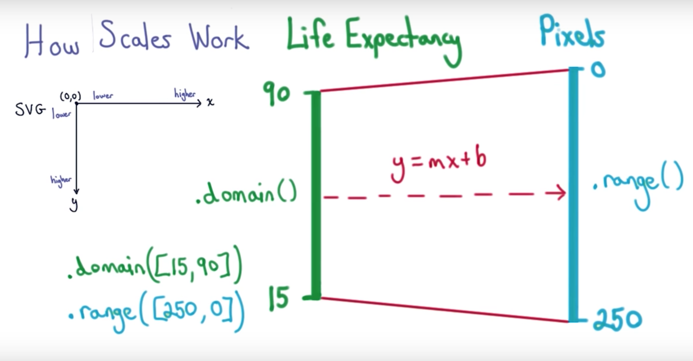
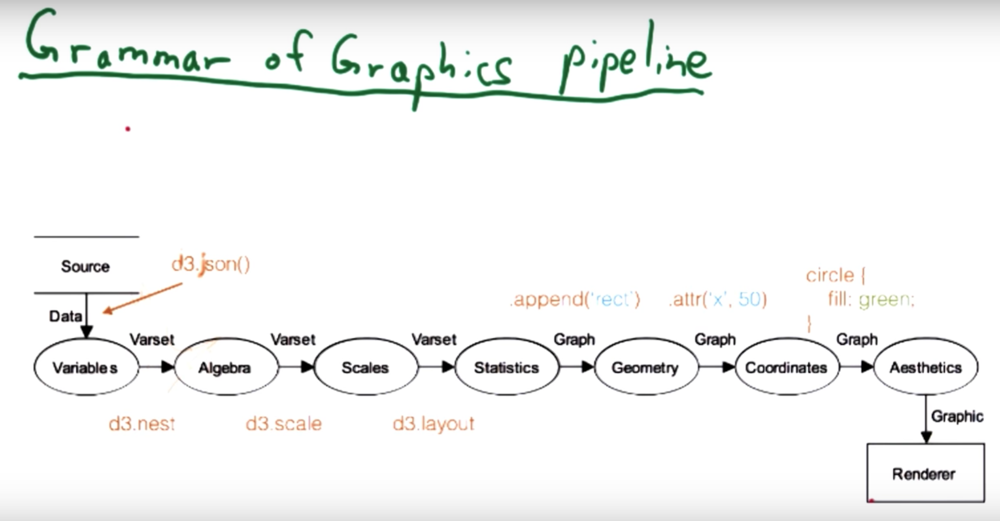

数据可视化的两个方面包括:数据探索和数据描述

# 数据描述经验的五个经验
数据描述的重要作用是——和需要沟通的用户建立相关的联系，需要从多角度的无偏颇的无主观导向的描述和分析。

1. 对内容背景进行理解
2. 了解受众是谁，他们需要知道什么和要做什么。思考如何呈现数据
3. 图形类型选择
4. 选择合适的图形表达相应的观点，能轻松直接的处理信息
5. 排除无效信息
6. 删除那些不会增加图像价值的信息和内容，减少受众的认知难度，吸引观众并让其认可观点
7. 对要表达的东西进行故事化描述

# 数据可视化理论
数据可视化是综合了CS、工程以及设计等三个方面的综合学科，在进行数据分析的过程中，数据挖掘、数据分析及数据可视化是在不断地进行交错优化。其相关的流程如下:



## 数据类型和可视化方式选择
数据可视化也是参考相关的可视化规则进行表达的，具体的表达规则如下:

1. 位置(Position)  主要作用是根据位置的不同，表达变量的大小
2. 视网膜变量(Retinal Variable)

	>在二维平面上很难去表达高维(主要是三维)上面，变量的大小差异。因此在实际使用中，通过<b>形状、大小等</b>其他方式来表达变量差异。<font color="red">尤其在对序列数据(Ordered Variable)类型时，面积大小、线条方向以及色彩饱和度特别有用</font>。其他的视网膜变量<font color="red">如色调(Color Hue)、形状(Shape)以及纹理(Texture)，对分类变量(Category Variable)表达上更有用</font>

3. 动态图形(Animation)
	>在对时间序列变化的表达时，凸显除了重要作用。因为它更能反映出随着时间变化，而变量数值的每帧变动。

## 可视化编码排序
数据可视化有多种不同的选择，包括位置、长度、角度、斜率、面积、体积、颜色以及密度等。在实际应用中需要考虑怎么选择编码。位置是可视化编码中最能准确表达数据的，色彩饱和度和密度相对不能准确表达数据数值。可视化编码的排序如下(在实际情况下需要根据实际情况进行选择):


## 绘图工具常用库
D3是和C/C++属于一个层级的工具，相对于HTML、CSS、SVG等来说。另外D3常用的package包括NVD3，Dimple.js, Ricksshaw——这些都是在D3之上的高级操作层，类似Python和Ruby；然后还有更高的接口层工具，如Raw和Chartio。D3操作的主要内容包括两个方面，一个是Charting libraries，另一个是Specific type of data。相关工具呈现的金字塔结构如下:


# D3使用
D3的调用可以通过不同的方式，在测试阶段可以在浏览器的Console中进行加载D3.js文件中的内容(即直接复制[D3的source](https://d3js.org/d3.v4.min.js)至console中运行即可调用)，这样可以直接使用D3；当然在测试阶段也可以使用赋值方式的调用来使用D3。以上两种方式都是可以在无D3.js的网页中调用D3。
<p>以下是在console中使用JavaScript赋值方式进行调用(原理是在HTML的DOM中增加D3的js调用)：

```javascript
var scrip = document.createElement("script");
script.type = "text/javascript";
script.src = "https://d3js.org.d3.v3.min.js";
document.head.append(script);
```

## D3重要API指导

1. Select工具

	>D3的select工具主要包括两个内容一个是Select，另一个是SelectAll——针对需要选择同一类的多个对象，返回一个含有多个值的数组。select可以直接选择element、class以及id等。<font color="#FA10">需要注意D3的select和自带的document.Getelementby方法以及document.querySelector(该方法是针对 CSS selector 的方法)返回值，不同后两者返回的是DOM而D3返回的是一个数组。</font>

	>某些多个element不具有class、id等标记来定位element时，可以采用通过select先定位该element的parent element，再使用select选择parent element下的element。

	>需要注意⚠️：在使用D3的方法时，最好不要通过document方法和D3方法交叉使用，以避免因为一些方法只能在D3对象中使用而报错：
	
	```
	//直接使用js方法
	doccument;	//返回HTML所有DOM
	window;	//返回浏览器窗口内容
	
	//获取ID方法
	document.getElementById("footer");	//获取ID为footer的DOM
	
	//通过CSS选择
	document.querySelector(".navbar");	//选择CSS中class名称为navbar的DOM
	
	//针对有多个类名称的CSS选择——不需要在类名称之间加空格
	document.querySelector(".navbar.navbar-inverse");	//类名称为同时有navbar和navbar-inverse的DOM
	
	//以下是使用D3的方法来选择DOM
	
	d3.select(".navbar") //选择第一个class为"navbar",注意其中使用了dot符号"."
	d3.select("h2") //选择第一个element为"h2"的DOM， 注意其中个没有使用dot符号
	d3.select("#header-logo")   //选择第一个id为"header-logo"的DOM，注意其中使用了Sharp符号"#"
	d3.selectAll("h2")  //返回多个满足element为"h2"的DOM，
	
	var parent_el = d3.select("#header-logo");  //需要选择img的DOM，但是有多个img且其没有独特的class或者id，所以先通过选择img的parent element——假设该element具有独特的ID值为"header-logo"
	
	var img_el = parent_el.select("img");    //再通过select选择parent element下的img
	
	var img_el = d3.select("#header-logo img")  //此方法直接使用一条语句完成了img对象选择，需要注意其中两个查找条件使用了一个Space(空格)
	```
	```JS
	var elem = document.getElementsByTagName("body");
	
	//使用d3的append方法
	elem.append("div");	//此时将报错
	```

2. 数据绑定
	>数据绑定有两种方法，enter 和 exit——但是两者方式不一样，enter() 会返回不在 index.html（页面上）的 data 的每行数据选择的所有元素；exit() 会返回 index.html（页面上）选择的未绑定到数据的所有元素。也就是说 exit 的作用在于，清楚不需要显示的对象
	>但是两者将在完成数据响应处理时，直接完成元素和数据之间的 update 。

3. 数值类型转换
	>字符串转换为日期类型，可以使用 d3.time.format(date_model) 来创建一个日期匹配模式——其中 date_model 是一个匹配模式，使用方法和 Linux 的日期模式相同。在创建模型之后，在调用 .parse(data) 来使数据进行更改。
	
	```
	//创建 27-05-1934 （16:00 h）模式的日期类型
	var format = d3.time.format("%d-%m-%Y (%H:%M h)");	
	//调用日期模型来更改相应的数据
	d3.tsv("world_cup_geo.tsv", function(d) {
		d["date"] = format.parse(d["date"]);
		}, draw);
		
	//以上通过调用匿名函数使 date 进行变更，另外调用了另一个函数 draw
	```
	
	>字符串转换为数值类型， Javascript 中可以通过一元加法（ + ）或一元减法 （ - ）来是字符串变更为数值类型。⚠️注意该方法只是针对引号掩盖下的数字，对自身本来就是字符串形式的数据转换后，是 NaN 。
	
	```
	//调用日期模型来更改相应的数据
	//通过一元加法来更改获得数值类型数据
	d3.tsv("world_cup_geo.tsv", function(d) {
		d["date"] = format.parse(d["date"]);
		d["attendance"] = +d["attendance"];
		},  draw);
	```
4. 数据类型检查
	>要对数据类型检查，可以通过 typeof 和 instanceof 来完成。但是两者存在差异， typeof 是返回数据类型，而 instanceof 是需要一个数据类型来判断数据是否为指定的数据类型，返回值是 boolen 值
	
	```
	typeof d;	//检查 d 的数据类型
	d instanceof Date;		//检查 d 是否为日期类型
	```

5. 利用 D3 来创建坐标轴
	>创建坐标轴，可以通过 dimple.js 中的方法 AddAxis 要相应快速和方便一些，但是使用 d3 要更灵活。 D3 的方法是使用 d3.svg.axis 的方法。关于坐标轴创建可以参考[在 D3.js 中设置刻度、域和范围](http://www.d3noob.org/2012/12/setting-scales-domains-and-ranges-in.html) 、 [关于轴——包括使用 call ](https://www.dashingd3js.com/d3js-axes) [详细 d3: scales, and color 作者： Jerome Cukier](http://www.jeromecukier.net/blog/2011/08/11/d3-scales-and-color/) 和 [ Scott Murray 讲解关于轴的短教程](http://alignedleft.com/tutorials/d3/axes)，简单示例说明如下：
	
	```
	//通过 time scale 来完成数据转换
	vat time_scale = d3.time.scale()
		.range([min_val, max_val])
		.domain(time_extent);		// time_extent 是数据的最大最小值的一个数组
		
	var time_axis = d3.svg.axis()		//创建一个坐标轴
		.scale(time_scale)				//利用 scale 来指定数据范围
		.ticks(d3.time.years, 2);		//通过 ticks 来指定刻度线方式，其中 d3.time.years 是指定坐标轴按年排序的方式，另外可以将 years 换为 days等
	```

6. 创建 legend 的图例说明
	>因为在创建完成图形之后，可能会因为对图裂说明不清晰而导致 viewer 不能理解图形表达的含义。因此我们需要在图形创建完成后，针对图形添加相应的图例说明。
	
	```
	var legend = svg.append("g")		//添加一个 group 的 tag ，作用相当于 div
	.attr("class", "legend")
	.attr("transform", "tanslate(" + (width - 100) + "," + 20 + ")")	//对 legend 的对象进行位置转换，并且制定到相应的位置
	.selectAll("g")	//添加新的 tag
	.data(["Home Team", "Others"])	//将需要添加的 legend 的数据进行绑定
	.enter()
	.append("g");		//完成数据的添加
	
	
	//以下是完成对图例的说明
	legend.append("circle")
		.attr("cy", function(d, i) {
			return i * 30;})
		.attr("cx", function(d, i) {
			if (d == "Home Team") {
				return radius * multiplier;
			} else {
				return radius;
			}
		})
		.attr("fill", function(d, i) {
			if (d == "Home Team") {
				return "red";
			} else {
				return "blue";
			}
		})
	
	legend.append("text")
		.attr("y", function(d, i) {
			return i * 30 + 5;})
		.attr("x", radius*5)
		.text(function(d) {
			return d;})
		
	```

	>text SVG 元素的 y 属性定义了下列活动的<font color="red"> 基线</font>（参考[**基线**](http://en.wikipedia.org/wiki/Baseline_(typography))），即在哪里绘制对应第一个字母（默认）左边缘的文本和 x 属性。或者更简单地说，x 和 y 定义了开始画文本的左下角的位置。 再看一眼展示了所有世界杯赛出席率的世界杯出席率图。更灵活的文字置中方法是使用文本元素的<font color="red"> text-anchor </font>（参考[text-anchor](https://developer.mozilla.org/en-US/docs/Web/SVG/Attribute/text-anchor)）和<font color="red"> alignment-baseline </font>（参考[alignment-baseline](https://developer.mozilla.org/en-US/docs/Web/SVG/Attribute/alignment-baseline)）属性。示例如下：
	

7. D3 聚合方法—— nest
	>如果需要对数据进行 Group 处理时，可以调用 nest方法。其使用流程是：1) 启用 nest 方法; 2) 调用 group 聚合的 key; 3) 使用 rollup 对聚合数据的运算处理; 4) 在聚合算法后使用 return 输出结果，当然结果可以是多种类型，包括单一值、数组或者对象。⚠️注意同时需要使用 entries 来输入 data

	```
	var nested = d3.nest()
						.key(function(d) {
							return d["date"].getUTCFullYear();
							})
						.rollup(function(leaves) {
							var total = d3.sum(leaves, function(d){
								return d["attendance"];
								});
							var coords = leaves.map(function(d) {
								return projection([+d.long, +d.lat]);
								});
							var center_x = d3.mean(coords, function(d) {
								return d[0];
								});
							var center_y = d3.mean(coords, function(d) {
								return d[1];
								});
							return {
							"attendance" : total,
							"x" : center_x,
							"y" : center_y
							};
							})
						.entries(data);
	// ⚠️注意 leaves 是自动获取到的，从 key 中传出的数据
	//另外使用了 map 映射函数来获取数据的经纬度， 并且通过 d3.mean 方法计算出对应的经纬度平均值——因为在世界杯举行的场馆可能有多个地址
	```

8. JavaScript 中的 map() 方法创建一个新数组，其结果是该数组中的每个元素都调用一个提供的函数后返回的结果。文档参考 [JavaScript 映射函数](https://developer.mozilla.org/en-US/docs/Web/JavaScript/Reference/Global_Objects/Array/map) ，示例如下：
	
	```
	let numbers = [1, 5, 10, 15];
	let doubles = numbers.map( x => x ** 2);
	```

9. 集合使用—— set
	>集合和其他编程语言的功能类似，都是为了创建一个独一无二的数据集。在 D3 中的 set 方法是创建集合的方法，其数据的添加需要使用 add ，当然还包括[其他方法](https://github.com/d3/d3-collection/blob/master/README.md#set)。使用示例如下：
	
	```
	var teams = d3.set();
	
	leaves.foreach(function(d) {
		teams.add(d["team1"]);
		teams.add(d["team2"]);
		});
	//因为该方法是在 nest 嵌套函数中使用的，所以利用了 leaves 变量名称。
	```


### 使用D3查询和更改CSS
使用D3来对CSS更改，首先需要建立一个selection——可以通过select方法创建一个D3的数组对象。如果要插队改selection的某个CSS对象的值，可以直接使用style方法并且传入相应的property；如果是要更改或者增加某个property，需要传入property对象和value——当要同时传入多个property时，可以使用js的对象来传入参数。方法如下：

```
//查询property值
var elem = d3.select(".navbar");		//通过select来选择第一个是navbar的类的DOM；返回值是一个Array

//查询该对象的background的值
elem.style("background");	

//更改background的值
elem.style({background:"red"});
elem.style("background", red");		//这两种方法都是可行的，但是第二种方法只针对更改某一个property时有效

elem.style({background:"red",  align-text:"center"});		//更改多个property时需要传入对象的方式
```
当在选择存在继承关系的对象时，可以通过加空格来选择。如果需要更改或者查询属性property和value，需要通过attr方法来调用。

```
var elem = d3.select("#header-logo img");		//img位于ID为header-log的子节点上
elem.attr("alt");		//查询img中alt的值
elem.attr("alt", "udacity");		//将alt值设置为udacity
```
## D3的绘图
使用D3进行绘图时，需要添加一个SVG的element；另外需要注意⚠️，如果需要更改attribute的值，需要逐步更改不能通过传入对象参数的方式添加：

```
svg = elem.append("svg");		//添加一个svg的element
svg.attr("width", 600).attr("height", 300);		//对svg的width和height属性进行更改，设置为宽度600px和高度为300px
```

对SVG图像上添加坐标轴的标尺，需要注意SVG是垂直方向上是向下像素点值增加的，但是水平方向上是从左到右像素值增大。原理如下：


因此在进行刻度值转换的时候，⚠️需要注意像素方向。在 D3 的 version 3  中提供了 scale 方法，同时需要调用 domain 以及 range 方法(<font color="red">需要注意的是其中传入 domian 参数是选取的最大值和最小值构建的array；而 range 的参数是对应的需要构建的像素值的array——另外需要注意两者的array应该是对应关系</font>)进行值和像素值转换；另外需要注意返回值是一个函数 。具体示例及添加图形如下：

```
//scale方法中有不同的转换刻度的方法，例如linear、log、sqrt等多种方式
var y = d3.scale.linear().domain([15， 90]).range([255, 0]);		//创建一个y的对象，取值范围是15到90，对应的像素点在255和0上
y(15);		//检验取值为15时的像素位置，结果会是255

var x = d3.scale.log().domain([250, 100000]).range([0, 600]);		//同理创建一个x的对象
var r = d3.scale.sqrt().domain([52070, 1380000000]).range([10, 50]);		//通过sqrt的方法来创建一个r对象
//绘图
var svg = elem.append("svg");		//添加一个SVG对象
svg.attr("width", 600).attr("height", 300);	
svg.append('circle').attr('r', r(1380000000)).attr('fill','red').attr('cx', x(13330)).attr('cy', y(77));		//添加一个圆形
```

### D3绘图流程
D3在绘图流程中需要对数据进行处理，转换为 js 可处理的 data ；之后使用 d3.nest() 来查找和组合数据； d3.scale() 是对讲数据转换为像素点的方法； d3.layout() 是对图形图层控制，选择和设置需要的图形；之后的 .attr 和 .append 及其他添加图形属性的方法是针对的 d3 的 selection 。 


>在以上例子中因为假设的数据时 json 类型文件，所以使用的是 d3.json() 来加载data；另外 d3.nest() 是重要的查找函数 

**对图形绘制重要内容说明**：

* d3.selection.append

	>将 HTML 或 SVG 元素插入网页

* d3.selection.attr

	>改变元素特征，比如位置或填充

* d3.json

	>加载数据文件，并且返回 Javascript 对象的一个数组

* d3.layout 

	>对预定义图表对象运用常见转换

* d3.nest

	>根据特定键对数据进行分组，并返回 JSON 的一个数组

* d3.scale

	>将数据转换为可以呈现的像素或颜色值

## 其他绘图

### 地图

通过D3来制作可视化地图，通常需要通过以下相关工具：

1.	GeoJson——数据源
	>地图的绘制，重要是得到数据点。可以通过 [Ogre](http://ogre.adc4gis.com/) 来获取数据将空间文件转换为 GeoJSON，了解 GeoJSON 值如何转化为视觉表征，[geojson.io](http://geojson.io/) 是一款交互式的 GeoJSON 编辑器，以及 [作者：Ben Balter 如何将形状文件转换为可在 Github 上使用的 GeoJSON](http://ben.balter.com/2013/06/26/how-to-convert-shapefiles-to-geojson-for-use-on-github/)

2. d3 的 mercator (墨卡托投影)的投影实现三维球体转换为二维平面图形——将关注点集中在需要表达的地方，对其他关注点较弱的地方进行扭曲转换，以换取关注点的真实性

3. 关于 D3 创建地图需要注意⚠️几点——一个是使用 projection 的时候需要注意根据不同的地图和数据源差异来选择不同的方案（例如 V4 版本中 d3.geoAlbersUsa 和 d3.geoPath 存在差异）；另一个是 topojson 的对象需要通过 topojson.feature 来转换对象为 geojson

相关参考：[关于D3地图的基础信息](https://bost.ocks.org/mike/map/)、[地图的基础信息_数据 2](http://mapschool.io/)

```
//启用 d3 的地图方法
var projection = d3.geo.mercator()
							.scale(170)
							.translate(width/2, height/2);		// scale 和 translate 的作用是转换图形以方便表达， scale 类似缩小和放大按钮， translate 是移动图形的方法

var path = d3.geo.path().projection(projection); //将使用的 projection  方法传入 d3 点映射中

var map = svg.selectAll("path")
  .data(geo_data.features)		//⚠️传入的数据不是完整的 data ，而是使用的 data 中的 features ，这个数据是对应的国家
  .enter()
  .append("path")
  .attr("d", path)		//赋予了一个属性，而值是一个 d3 回调函数 path ，它会去处理绑定的每个元素
  .style("stroke", "white")	//使用 style 方法是更改图形 CSS 属性和值以改变地图效果
  .style("stroke", "black");
```

### 动态图像
使用 D3 来创建动态图形的思路：1）给定条件判断已有的数据是否一致；2）利用 D3 的 exit 方法来选定不符合条件的对象；3）利用 D3 的 remove 方法来移除 exit的对象；4）再利用 enter 方法将更新的数据绑定到对象中。⚠️注意需要使用到的filter方法。使用案例如下：

```
//year 为指定的年份，nested 为之前 nest 方法创建的对象，其 key 是年
var filtered = nested.filter(function(d) {
	return new Date(d["key"]).getUTCFullYear() === year;
	});
// key_func 是一个返回 year 的函数
function key_func(d) {
    return d['key'];
}
	
var circles = svg.selectAll("circle")
					.data(filtered, key_func)
                 .transition()	//藉由这个transition 来完成图表的动态效果
                 .duration(500);		//.duration(1000)，表示会在一秒内抵达下方，不添加该方法默认的 transition 是 0.25 秒
```

相关文档参考[使用 D3.js 创建动画和过渡（作者：Jerome Cukier）](http://www.jeromecukier.net/blog/2012/07/16/animations-and-transitions/)、[作者：Scott Becker 学习 D3：动画与互动—第 3 部分](http://synthesis.sbecker.net/articles/2012/07/10/learning-d3-part-3-animation-interaction)、[作者：Andreas Koller D3 与 UI 动画](http://blog.andreaskoller.com/2014/02/d3-and-ui-animations/)、[创建动画_3](http://www.d3noob.org/2013/02/update-d3js-data-dynamically.html)、[SVG D3.js - transition 基本篇](http://www.oxxostudio.tw/articles/201501/svg-d3-14-transition-1.html)

是可视化图像动态话，可以通过调用 JavaScript 的 setInterval 方法或者 setTimeout 方法。为了后续动态图像完成后，能够增加相应的互动性，可以使用 clearInterval 方法来结束动态性，文档参考[动态更新 D3 数据](http://www.d3noob.org/2013/02/update-d3js-data-dynamically.html)。示例如下：

```
var year_interval = setInterval(function() {
  update(years[year_idx]);

  year_idx++;

  if(year_idx >= years.length) {
      clearInterval(year_interval);

      var buttons = d3.select("body")
              .append("div")
              .attr("class", "years_buttons")
              .selectAll("div")
              .data(years)
              .enter()
              .append("div")
              .text(function(d) {
                  return d;
              });

      buttons.on("click", function(d) {
          d3.select(this)
            .transition()
            .duration(500)
            .style("background", "lightBlue")
            .style("color", "white");
          update(d);
      });
  }
}, 1000);
```

### 交互式图像
针对图像的交互，需要通过对某些事件监听，然后调用相应方法来完成。主要对方法包括鼠标悬停、移出或则会点击等事件监听（参考[D3.js 鼠标事件 作者：Anthony Nosek ](http://www.stator-afm.com/tutorial/d3-js-mouse-events/)、[鼠标悬停、鼠标移出、鼠标按下教程 作者：Christophe Viau ](http://christopheviau.com/d3_tutorial/)以及[向 D3.js 图形添加工具提示](http://www.d3noob.org/2013/01/adding-tooltips-to-d3js-graph.html)），调用其他相关函数或者方法来完成交互。

另外需要注意，对 this 的使用——在交互时指向的是监听事件所应用的对象，可以提供相应的简便方法——参考[清楚理解并掌握 JavasScript 的 'this'](http://javascriptissexy.com/understand-javascripts-this-with-clarity-and-master-it/)以及[ this 快速参考](http://tomhicks.github.io/code/2014/08/11/some-of-this.html)


# 启动本地server
推荐两种方式，一种是通过python来建设 local server ；另一种是通过 npm 下载一个 http-server 来搭建 local server。方法如下；

方式一 python 自带的http.server模块：

```
python -m http.server	#直接在cmd中运行该命令，会启动一个端口在8000的 local server

python -m http.server 8080	#手动穿件端口号8080
```

方式二，通过npm下载一个 http-server 后，运行该http-server来搭建

```
npm install -g http-server	#安装一个http-server
http-server & 	#后台运行http-server
```
以上都可以在浏览器中通过localhost:port/filename来运行html文件。


# 参考

1. [Data Art vs. Data Visualization: Why Does a Distinction Matter](http://www.perceptualedge.com/blog/?p=1245)

	>数据可视化的重要作用是通过可视化的方法，让受众理解数据，需要达到的是正确而清晰的表达观点；而数据艺术的作用让数据表达具有美感，达到情感表达的目的
	
2. <a href="doc/encoding_values_in_graph.pdf">Encoding Values In Graph</a>
	>点的使用时阐明在图片中的位置，具备其他信息编码不具备的重要特点。另外点可以使用不同的方式来表示，如点形、方形、正方形以及三角形等。主要作用时针对两个数值型变量的关系表达，以及分类型变量的数量统计。在实际使用中可以在水平和垂直方向上表示，因为点图和高度以及宽度无关。<font color="grey">在表示序列型数值(如时间序列时)，最好不要单独使用点来表示，因为它不能表达趋势</font>
	
	>线的使用，可以看作是点的空间延深，主要作用是表示 从一个值到另一个值的变化关系。另一方面在分析多数值的趋势时，可以将点和线进行结合使用，这样更能反应出对比的效果。<font color="grey">对于离散型的数据等非序列型数据，最好不要使用线来表示，因为非序列型数据不具备分析前后变化的可能性。</font>另外线的斜率表示了线的变化趋势。
	
	>条形图(Bar)的使用，主要时针对多对象的数据编码。和点线不同的是，编码的对象是沿着坐标轴来独立来表达的；另一方面和点线相同的是它在端点上衡量其数值大小。<font color="grey">条形图的重要作用是在表达独立的对象的数据，且能够通过条形长度来对比大小的不同。为了向使用者表达独立的值及其同类型对象独立值的对比，使用条形图是最好的选择。</font>在实际情况下，当然可以使用条形图来表达时间序列型数据，这是因为需要在时间序列上去表达不同对象的值的差异——主要针对是差异性较小，需要条形来直观表现这种差异，当差异较大时不建议使用条形图。

3. [Visual Encoding Example](https://www.targetprocess.com/articles/visual-encoding/)

4. [Web Functional Art](http://www.thefunctionalart.com/)

5. [web Visualising Data](http://visualisingdata.com/)

6. [Web Story Telling With Data](http://www.storytellingwithdata.com/)

7. [web Help Meviz](http://helpmeviz.com/)

8. [Web D3](http://d3js.org/)

9. [Web Tableu](http://www.tableausoftware.com/public/)

10. [Web RAW](http://raw.densitydesign.org/)

11. [Web Illustrator](http://www.adobe.com/products/illustrator.html)

12. [Rickshaw](http://code.shutterstock.com/rickshaw/)

13. [数据绑定和selection解释](https://bost.ocks.org/mike/selection/)

14. [数据绑定和selection解释——中文](http://sj82516-blog.logdown.com/posts/1139171)

15. [数据绑定和selection解释——中文](https://github.com/FrankFang/githublog/blob/master/D3%E4%B8%AD%E7%9A%84selection%E6%98%AF%E5%A6%82%E4%BD%95%E5%B7%A5%E4%BD%9C%E7%9A%84.md)

