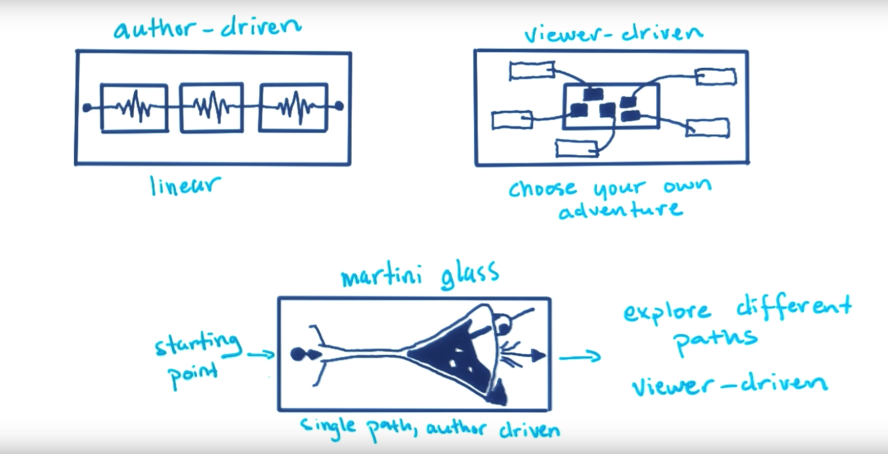

# 可视化叙事
可视化描述，不再似传统信息表达，更加注重读者和数据的交互以及读者个人的认知。因此在创建可视化的过程中，可能会让数据图来回切换同时表以相应的描述。

数据可视化过程中的重要过程是收集和处理数据，另外需要理解可视化的**语境和叙事性**。叙事性强调的是需要把需要表达的内容串联到一起。同时，在表达方面需要注意**因果性和相关性**。

### 数据可视化的重点
创建数据可视化 90% 的时间实际上都花在“寻找、验证、解析、筛选和探索数据”上。在数据科学及尝试回答数据问题的背景下，的确如此。幸运的是，有很多资源可以任你使用，来解决这些重要的任务。对数据获取可以参考[Getting Data from the Web - The Data Journalism Handbook-五分钟实战指南](http://datajournalismhandbook.org/1.0/en/getting_data_3.html)

# 数据可视化偏差

1. 作者偏差
	
	>可视化呈现者，有意或者无意的利用视觉效果造成数据偏差。另一方面个人数据，因其是个人化的，很难去判断是否具有客观性和普遍性

2. 数据偏差
	
	>主要是指数据收集、处理过程中的，客观或者主观的数据问题。系统测量误差或有缺陷的设备会使原始数据值产生偏差，而选择偏差会导致不能代表特定问题兴趣群体的子组。相关内容参考[数据收集](http://en.wikipedia.org/wiki/Data_collection)、[抽样方法](http://en.wikipedia.org/wiki/Sampling_(statistics)#Sampling_methods)或[其他偏差](http://en.wikipedia.org/wiki/Bias_(statistics))。

3. 读者偏差

	>主要指任何读者在解释可视化时带入的先入观念或假设。此假设可能与读者的领域知识或数据可视化的话题有关。例如，如果你稍微了解世界杯，你就可能清楚这项比赛的举办频率，以及世界杯的比赛和阶段结构。

	>其他假设还可能涉及政治、宗教、文化信仰或读者对特定图表类型的熟悉程度。在设计可视化时，你应该始终考虑到读者的背景和对图形的熟悉度。

	>设计者（编码者）和读者（解码者）都应注意偏差。设计者的选择或读者对图形的解读都会影响交流的有效性。这模糊了数据可视化中误导和欺骗的界线，只有运用分析思维和尽职调查，设计者和读者才能进行可信的信息交换。相关内容参考[《虚假信息可视化》(Disinformation Visualization)](https://visualisingadvocacy.org/blog/disinformation-visualization-how-lie-datavis)

# 数据可视化的叙事结构
1. 作者驱动叙事——Author-Driven Nattative
	>以开始到结束的方式进行的线性叙事结构。这一类主要被用于探索小数据，需要有严谨地叙事结构和丰富的信息量，以及控制叙事的清晰度和速度；

2. 观众驱动叙事——Viewer-Driven Narrative
	>有一个开始，并且通过用户自己选择二具有不同的多角度叙事结构。不一定有特定的叙事结构，由观众自己提出问题、探索故事来描述其自己的数据故事。需要注意，两种叙事模式在实际情况下存在交叉。

	>**读者视角驱动**，注重从读者个人角度去分析问题，可以参考一下内容：[“旧金山犯罪直击”(San Francisco Crimespotting)](http://sanfrancisco.crimespotting.org/) 和 [白宫之路 (Paths to the White House)](http://www.nytimes.com/interactive/2012/11/02/us/politics/paths-to-the-white-house.html)

3. 马提尼杯——Martini Glass式
	>该类型的叙事模式，更强调将第一类和第二类结合。展示的例子如：[无人机空袭](http://drones.pitchinteractive.com/) 和 [枪击死亡](http://guns.periscopic.com/)
	
**三种叙事方式展示：**

任何叙事结构，都需要注意一点——将信息表达明确。

# 参考

1. [获取数据](http://datajournalismhandbook.org/1.0/en/getting_data.html)
	>说明了了数据获取方式以及相应的方法，在数据获取方面的建议，可以从搜索引擎、API等方式

2. [利用数据叙事 Stanford paper](http://vis.stanford.edu/files/2010-Narrative-InfoVis.pdf)

3. [利用可视化来欺骗](https://visualisingadvocacy.org/blog/disinformation-visualization-how-lie-datavis)

4. [书籍—— Ritchie S. King 的运用 D3 进行视觉叙事](http://ritchiesking.com/book/)
