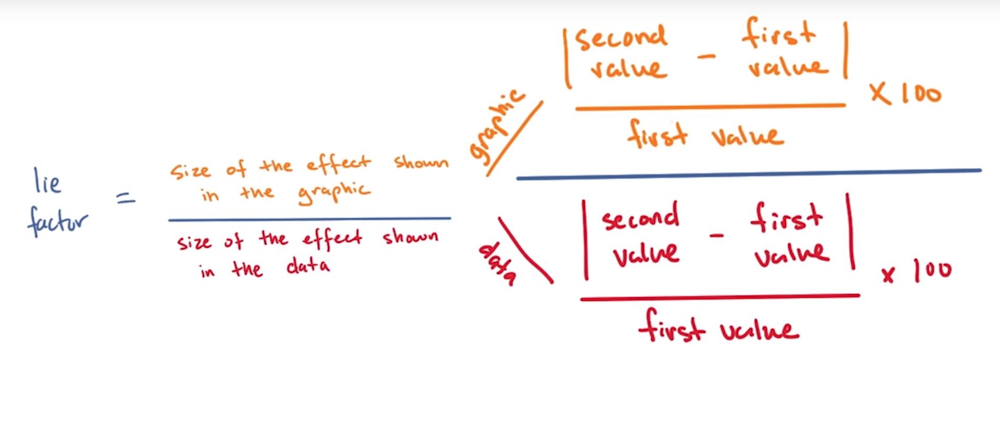
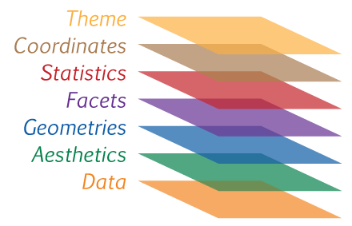

# 可视化元素
数据可视化需要合适的方式将数据元素进行组合，以表达数据需要传达出的意思。就像语言表达有专门的语法规则一样，图表的表达还是有相应的规则。主要可选择的可视化思路，见下图:

对于不同图形的选择，首先需要弄清楚需要使用图形表达什么观点、图形变量是一中什么关系——双变量关系、分布关系还是比较。以上关系能够明确选择什么图形来表达观点，之后才是思考需要什么样的方式才能让读者或者观众能够快速而准确理解表达的意思。

## 图形前注意属性

对某些图形添加一些其他属性，以增强视觉感知效果——例如颜色、运动、图形形状以及空间位置变化。具体可以参考[发掘视觉认知的能力](http://www.perceptualedge.com/articles/ie/visual_perception.pdf)。

## 负空间使用——White Space

利用负空间一方面可以增强说明文字差异，例如两个单词之间空格，表格之间利用色调差异来表现行与行；另一方方面，可以利用负空间创造新的视角，构造新的图形，例如NBC利用负空间创造一个孔雀图形。

另一方面，在使用负空间时，需要考虑图形友好性避免过多使用ink，减弱图形的关系

# 图形类型选择

数据可视化的作用是通过可视化的方式来解决问题，因此选择**合适的工具**和**合适的方式**来解决问题是首要的。而在实际情况中，图形类型选择**依据**主要有:1)可视化编码元素，2)数据类型，3)关系。另外需要特别提醒⏰一点，表格（ table ）也是可视化表达的方式之一——主要是用在多个 nominal variable 类型中，表示一一对应的关系。

1. 数据类型

	>数据的主要类型主要是包括两类——连续性数据和分类型数据；然而在数据维度区分数据，数据就可能从一维到N维都有可能。

2. 可视化类型编码
	
	>选择使用正确的颜色、图形等，元素进行数据解析。例如:颜色选用，可以适当使用黑白或者色彩不强烈的颜色去表达。

## 图形认知原理
认知的**[格式塔原理](http://graphicdesign.spokanefalls.edu/tutorials/process/gestaltprinciples/gestaltprinc.htm)**,我们以特定方式整理看到的事物，从而理解视觉信息。主要的原则是整体大于部分的简单相加，更重要是通过有效的方式吸引注意及组织部件。六大原理影响着人类看到并理解视觉信息的方式。

1. 接近性 PROXIMITY

	>在视觉效应中，相接近的各元素易放在一起，组织成为群组
	
2. 相似性 SIMILARITY
	
	>在具有相似属性的对象，更容易在视觉上被认为是群组
	
3. 图形与背景 FIGURE AND GROUND

	>图形和背景极易在感知上被聚合在一起，从而产生新的东西。

4. 连续性 CONTINUITY

	>在相关方向上的各对象，容易被认为具有相关性，或者具有同方向性

5. 封闭性 CLOSURE

	>在感知方面，具有封闭趋势的对象，其间隔和非连续线图很容易被感知为封闭的

6. 简单性 SIMPLICITY

	>使用简单的方式，来解决可视化的问题，不用过分强调图形的复杂性。

## 图表垃圾——chartjunk
根据Edward Tufte在**《定量信息的视觉呈现》**中的描述：用于装饰图形的大量墨水并没有告诉读者更多的信息。装饰的目的各不相同，有些是为了使图形看起来更加科学和精准，有些是为了使图形更加生动，有些是为了让设计人员有机会练习艺术技能。无论什么原因，用到的都是非数据墨水或冗余数据墨水，通常都是些图表垃圾。

在数据可视化中的图表垃圾，主要包括**多余的表格线**、**非必要的文本**、**装饰的图标轴**、**图形中嵌入了图片**以及**其他阴影和3D效果**展示。

## 图形评价——有效信息评价
评价一个图形的有效性可以从以下几个角度:

1. 数据墨水比例(Data Ink Ratio)

	>数据墨水公式：$data\_ink\_ratio\ =\ \frac{ink\_used\_describe\_data}{ink\_used\_describe\_everything\_else}$
2. 失真系数(Lie Factor)

	>失真系数，指图表中展示的效果大小除以数据中展示的效果大小的比例。数学表达式：${line\_factor}\ =\ \frac{size\_of\_the\_effect\_shown\_in\_the\_graph}{size\_of\_the\_effect\_shown\_in\_the\_the\_data}$。一般理想的失真系数要求在0.95和1.05之间，当然最理想的值是1。具体计算方式如下:
	

# 图形语法

**图形语法**是 Leland Wilkinson 于 1999 年在同名书籍 《图形语法》中首次提出的一种可视化理论。该理论涉及范围相当广泛，影响了图形和可视化库（包括 D3 及其前驱）的发展，其中的 **3 个关键原理**：

1. 美学与数据的分离

	>Data: The actual variables to be plotted
	>Aesthetics: The scales onto which we will map our data
	>Geometries: Shapes used to represent our data
	>以上三者构成了图形语法的基本元素，即数据、数据转换美化、基本图形模式
	>Facets: Rows and columns of sub-plots
	>Statistics: Statistical models & summaries
	>Coordinates: The plotting space we are using
	>以上三者是定义图形的高级语法，大部分优化变现都是通过这三者完成
	>Theme: Describes non-data ink
	>最后一个 theme 主要针对的是非数据描述
	>
2. 常见图形/图表元素的定义
3. 这些常见元素的构成

### 关注点分隔
从数据的视觉呈现中分离数据的好处，以下为主要的几点：

1. 独立转换并展示数据
2. 委派工作和责任
	* 工程师关注数据操纵
	* 设计人员关注数据的视觉编码
3. 展示数据集的多个视觉表征
	* 不包括：气泡图和线条图呈现数据集的不同分面。

### 常见元素
当你想创建图表或图形时，从视觉上分解你希望实现的目的通常很有帮助。需要考虑如何将图表提取到更为基础的视觉编码中。在地图示例中，你看到的面量图是地形和颜色的结合，而统计图是地形和尺寸的结合。在谈论可**组合的元素**时，最常见的就是：

1. 坐标系（笛卡尔与径向/极坐标系）—— **[ 边缘惯例 (Margin Convention)](https://bl.ocks.org/mbostock/3019563)**
2. 标尺（线性、对数等）
3. 文本注释
4. 形状（线条、圆圈等）
5. 数据类型（分类、连续等）

### 构成
将这些常见元素组合到一起时，就能发现图形语法的迷人之处了。例如，可以在笛卡尔空间中，将数据值映射到条形高度，从而创建条形图；也可以在极坐标系中映射这些值（数据值对应到切片的径向度数），得到饼状图。

* 分类数据 + 连续数据 x 笛卡尔坐标系 = 条形图
* 分类数据 + 连续数据 x 极坐标系 = 饼状图
* 连续数据 + 连续数据 x 笛卡尔坐标系 = 散点图

>你可以通过不同的方式组合这些常见元素，从而创建许多其他的图表。

# 参考
1. [颜色使用规则:Stephen Few](http://www.perceptualedge.com/articles/visual_business_intelligence/rules_for_using_color.pdf)

关于颜色的选择需要考虑颜色的使用场景:1)在文本中使用颜色建议，背景色保持一致，背景色和文字颜色需要高对比度;2)使用颜色需要针对相应的交流目的，需要多彩色系的场景应该是使用相同的数据需要表达出不同的意义。多色系颜色及深色易使人产生疲劳;3)使用自然色彩去显示常规信息，对于需要突出强调、分组的信息时，可以使用亮色或者暗色系色彩;4)针对数量型数据的颜色编码方案，推荐使用单一或者色调相似的颜色来编码数据，主要通过颜色的深浅来表示数据的大小。5)针对可视化的非数据元件，仅需要表达出各元件的可视化角色，避免宣宾度主的情况;6)针对颜色使用时候，需要注意避免红绿色以使更多人能够读懂数据;7)在可视化中尽量避免使用可视化增强效果，例如:光线方向、阴影等，这些效果对数据解释没有太大的意义

2. [调试color palette的网络工具](http://www.colorbrewer.org/)
	>注意其中针对diverge类型是连续性数据，是指数据是向两个方向的序列类型，其使用的数据方案主要是从中间向两侧发展。例如在做公司盈利的热力图时，有盈亏差异且需要表查盈亏的大小时，需要参考diverge的颜色方案

3. [R 中的颜色选择方案一](http://www.r-bloggers.com/choosing-colour-palettes-part-i-introduction/)

4. [R 中的颜色选择方案二](http://www.r-bloggers.com/choosing-colour-palettes-part-ii-educated-choices/)

5. [R 中颜色选择代码范本](http://www.cookbook-r.com/Graphs/Colors_(ggplot2)/)

	[R图形语言](https://ramnathv.github.io/pycon2014-r/visualize/ggplot2.html)

6. [数据可视化中的格式塔夫准则](https://emeeks.github.io/gestaltdataviz/section1.html)
	>阐释了相似性、闭合性、接近性的三个原则的在数据可视化中的应用

7. [图表中栅栏(grid)的使用](http://www.perceptualedge.com/articles/dmreview/grid_lines.pdf)
	>图表中使用栅栏主要因为以下几个原因:1)图表太大，需要栅栏来增加认知;2)图表中对比差异较小，需要grid来增强差异;3)在分类数据进行比较时，增强比较;4)需要通过栅栏聚焦特定的区域。以上核心就是一点——细节是关键

8. [Google字体](https://fonts.google.com/)

9. [多层式图形语法 Hadley Wickham](http://byrneslab.net/classes/biol607/readings/wickham_layered-grammar.pdf)
	>需要注意图形和数据分离存在的问题和优势：
	
	>One advantage is specialization - you can have experts that focus on gathering and analyzing the data with specific expertise in that area, and then another group of experts that are really good at presentation. Another advantage is that you don't have to think about the presentation when you are simply trying to collect and explore the data
	
	>A disadvantage is potential communication challenges between engineers and designers.——因为数据可视化过程中可能会进行数据转换，而出现数据和可视化分离的问题

10. [图形语法绘制概念简介](http://www.science-craft.com/2014/07/08/introducing-the-grammar-of-graphics-plotting-concept/)

11. [用 R 中 ggplot 来阐释图形语法](https://ramnathv.github.io/pycon2014-r/visualize/ggplot2.html)

12. [波形图](http://www.edwardtufte.com/bboard/q-and-a-fetch-msg?msg_id=0001OR)

	>Edward Tufte 发明的这些袖珍图形，用于在小型图表区域内包含大量信息。通过查看波形图，读者可以快速了解历史趋势、异态和指标的当前状态

13. [图形中的网格线](http://www.perceptualedge.com/articles/dmreview/grid_lines.pdf)

	>针对网格线使用时，需要注意网格线是否有助于对图形内容阐释和其他信息表达
