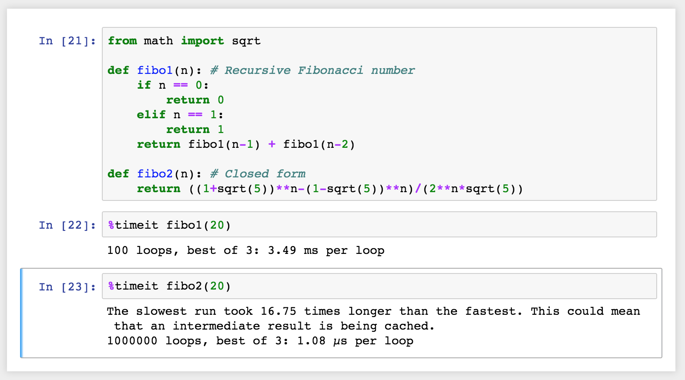

* [python查找环境](#1)
* [保存和加载环境](#2)
* [数学表达式](#3)
* [Magic 方法](#4)
* [seaborn使用注意事项](#5)
* [Python运算符重载](#6)

[toc]


<h4 id="1">python查找环境</h4>
<p>在python文件中，常用到/usr/bin/python来指定运行python。但是有些系统中的python并未安装在/usr/bin中，所以采用另一个思路来解决这个问题，即使用env来保证python被启动。使用的命令<code>#!/usr/bin/env python</code>来调用python，这样的文件更具有<font color="red">移植性</font></p>

<h4 id="2">保存和加载环境</h4>
<p>当需要对Python的环境类型(例如Python 2.X和3.X的不同版本)及其在工作环境中的依赖等进行保存，那么可以使用相关命令进行保存。<code>conda env export > enviroment.yaml
</code>，该命令将包保存为YAML文件，同时可以一次文件进行环境共享。如果需要完成环境加载可以使用以下命令，<code>conda env create -f enviroment.yaml</code>，这样创建了一个新的环境并且具有yaml文件中的库。对于不适用Anacodna进行package管理时，如果需要共享安装的库内容，可以使用<code>pip freeze > requirements.txt</code>进行保存库列表，以分享工作环境。</p>

<h4 id="3">数学表达式使用</h4>
<p>在jupyter notebook中使用数学表达式，是利用[LaTeX - A document preparation system](https://www.latex-project.org/)符号来创建数学表达式。要启动数学模式，请在 LaTeX 符号两侧加上美元符号（例如 $y = mx + b$），以创建内联的数学表达式。对于数学符号块，请使用两个美元符号：
	<code>$$
	y = \frac{a}{b+c}
	$$</code>。其他详细的LaTex文档说明，详见[A Primer on Using LaTeX in Jupyter Notebooks | Democratizing Data](http://data-blog.udacity.com/posts/2016/10/latex-primer/)</p>

<h4 id="4">magic 方法</h4>
<p>Magic 关键字是可以在单元格中运行的特殊命令，能让你控制 notebook 本身或执行系统调用（例如更改目录）。例如，在 notebook 中可以使用<code>%matplotlib</code>将 matplotlib 设置为以交互方式工作。</p>
<p>Magic 命令的前面带有一个或两个百分号（% 或 %%），分别对应行 Magic 命令和单元格 Magic 命令。行 Magic 命令仅应用于编写 Magic 命令时所在的行，而单元格 Magic 命令应用于整个单元格。</p>
<p>注意：这些 Magic 关键字是特定于普通 Python 内核的关键字。如果使用其他内核，这些关键字很有可能无效。</p>

**代码计时**
<p>有时候，你可能要花些精力优化代码，让代码运行得更快。在此优化过程中，必须对代码的运行速度进行计时。可以使用 Magic 命令<code>timeit</code>测算函数的运行时间，如下所示：</p>

<p>如果要测算整个单元格的运行时间，请使用<code>%%timeit</code>，如下所示：</p>


**在 notebook 中嵌入可视化内容**
<p>如前所述，notebook 允许你将图像与文本和代码一起嵌入。这在你使用 matplotlib 或其他绘图包创建可视化内容时最为有用。在 notebook 中可以使用<code>%matplotlib</code>将<code>matplotlib</code>设置为以交互方式工作。默认情况下，图形呈现在各自的窗口中。但是，你可以通过命令传递参数，以选择特定的[“后端”](http://matplotlib.org/faq/usage_faq.html#what-is-a-backend)（呈现图像的软件）。要直接在 notebook 中呈现图形，应将通过命令<CODE>%matplotlib inline</CODE>内联后端一起使用。</p>
<span>
<font color="red">提示：</font>在分辨率较高的屏幕（例如 Retina 显示屏）上，notebook 中的默认图像可能会显得模糊。可以在<code>%matplotlib inline</code>之后使用<code>%config InlineBackend.figure_format = 'retina'</code> 来呈现分辨率较高的图像。</span>
<span></span>

**notebook 中的图形示例**
<p>在notebook 中进行调试对于 Python 内核，可以使用 Magic 命令<code>%pdb</code> 开启交互式调试器。出错时，你能检查当前命名空间中的变量。</p>

<p>在上图中，可以看到我尝试对字符串求和，这造成了错误。调试器指出了该错误，并提示你检查代码。</p>
<p>要详细了解 pdb，请阅读此[文档](https://docs.python.org/3/library/pdb.html)。要退出调试器，在提示符中输入 q 即可。</p>
<p>其他magic方法[列表](https://ipython.readthedocs.io/en/stable/interactive/magics.html)</p>

<h4 id="5">seaborn 使用注意事项</h4>
<p>jupyter notebook中使用seaborn的时候，需要注意版本。0.8之后的版本，需要设置<code>color_codes</code>参数才能调用seaborn pallette。设置方式是在cell中输入<code>seaborn.set(color_codes=True)</code>。详情见<a href="https://seaborn.pydata.org/generated/seaborn.set.html#seaborn.set">seaborn文档</a></p>


<h4 id=6>Python 运算符重载</h4>
<p>运算重载是用类写成的对象，可以截获并响应在内置类型上的运算：加法、切片、打印、和点号运算等。表达式和其他内置运算流程要经过类的实现来控制——自动分发机制；另外模块可以实现函数的调用，但是不是表达式的行为。其重要作用是在模仿内置对象，促进对象接口更一致，便于学习，让类对象由预期的内置类型接口代码处理。</p>
<ol>
	<li>以双下划线命名的方法(例如：__z__)提供特殊的钩子</li>
	<li>实例出现内置运算时，这类方法自动调用</li>
	<li>类可以覆盖多数内置类型的运算——有几十种热熟的运算符重载的方法名称，基本上可以实现内置类型的所有运算</li>
	<li>运算符不会覆盖默认的内置方法——因为没有运算符重载，其内置类型可能就不会运算而报错</li>
</ol>

注意运算符重载主要是针对

## 文本的 MapReduce 模拟
在文本中利用了 字符串的 translate 方法对字符串中字符进行转换，同时使用字符串的 meketrans 方法可以创建一个针对某些特定字符串的 key-value 对，以及需要删除的字符。⚠️注意 python 2.X 和 python 3.X 使用 translate 方法时，两者具有差异。

```{python 2.X}
import logging
import sys
import string

from util import logfile

logging.basicConfig(filename=logfile, format='%(message)s',
                   level=logging.INFO, filemode='w')


def word_count():
    # For this exercise, write a program that serially counts the number of occurrences
    # of each word in the book Alice in Wonderland.
    #
    # The text of Alice in Wonderland will be fed into your program line-by-line.
    # Your program needs to take each line and do the following:
    # 1) Tokenize the line into string tokens by whitespace
    #    Example: "Hello, World!" should be converted into "Hello," and "World!"
    #    (This part has been done for you.)
    #
    # 2) Remove all punctuation
    #    Example: "Hello," and "World!" should be converted into "Hello" and "World"
    #
    # 3) Make all letters lowercase
    #    Example: "Hello" and "World" should be converted to "hello" and "world"
    #
    # Store the the number of times that a word appears in Alice in Wonderland
    # in the word_counts dictionary, and then *print* (don't return) that dictionary
    #
    # In this exercise, print statements will be considered your final output. Because
    # of this, printing a debug statement will cause the grader to break. Instead, 
    # you can use the logging module which we've configured for you.
    #
    # For example:
    # logging.info("My debugging message")
    #
    # The logging module can be used to give you more control over your
    # debugging or other messages than you can get by printing them. Messages 
    # logged via the logger we configured will be saved to a
    # file. If you click "Test Run", then you will see the contents of that file
    # once your program has finished running.
    # 
    # The logging module also has other capabilities; see 
    # https://docs.python.org/2/library/logging.html
    # for more information.

    word_counts = {}

    for line in sys.stdin:
        data = line.strip().split(" ")
        
        for i in data:
            key = i.translate(string.maketrans("",""),string.punctuation).lower()
            if key not in word_counts:
                word_counts[key] = 1
            else:
                word_counts[key] += 1
    print word_counts
```

针对 python 版本差异导致的代码差异，3.x版本中一个是 maketrans 方法在 str 模块中了，另一个是删除字符放置位置是在 maketrans 中。具体代码比较如下：

```
# python 2.x 版本使用 translate 时候，通过 string.punctuation 来建立需要删除的标点符号字符的方法如下
i = "a,b@cd"
i.translate(string.maketrans("",""),string.punctuation)


# python 3.x 版本使用 translate 的时候， maketrans 方法在 str 模块中了不在 string 模块，另外删除标点字符串的需要放在 maketrans 中，而非 translate 中
a = 'a,b!cd@'
a.translate(str.maketrans("","", string.punctuation))

```
文档参考[Python 中 maketrans 与 translate 的用法-简书](https://www.jianshu.com/p/67dd061db63a)。

以下是对文本内容利用 Mapper 和 Reducer 的方法模拟 MapReduce ：

以下是模拟 mapper：

```
import sys
import string
import logging

from util import mapper_logfile
logging.basicConfig(filename=mapper_logfile, format='%(message)s',
                    level=logging.INFO, filemode='w')

def mapper():

    #Also make sure to fill out the reducer code before clicking "Test Run" or "Submit".

    #Each line will be a comma-separated list of values. The
    #header row WILL be included. Tokenize each row using the 
    #commas, and emit (i.e. print) a key-value pair containing the 
    #district (not state) and Aadhaar generated, separated by a tab. 
    #Skip rows without the correct number of tokens and also skip 
    #the header row.

    #You can see a copy of the the input Aadhaar data
    #in the link below:
    #https://www.dropbox.com/s/vn8t4uulbsfmalo/aadhaar_data.csv

    #Since you are printing the output of your program, printing a debug 
    #statement will interfere with the operation of the grader. Instead, 
    #use the logging module, which we've configured to log to a file printed 
    #when you click "Test Run". For example:
    #logging.info("My debugging message")
    #
    #Note that, unlike print, logging.info will take only a single argument.
    #So logging.info("my message") will work, but logging.info("my","message") will not.

    for line in sys.stdin:
        data = line.strip().split(",")
        if len(data) != 12 or data[0] == "Registrar":
            continue
        print "{0}\t{1}".format(data[3], data[8])
        

mapper()

```
以下是 reducer 模拟：

```
import sys
import logging

from util import reducer_logfile
logging.basicConfig(filename=reducer_logfile, format='%(message)s',
                    level=logging.INFO, filemode='w')

def reducer():
    
    #Also make sure to fill out the mapper code before clicking "Test Run" or "Submit".

    #Each line will be a key-value pair separated by a tab character.
    #Print out each key once, along with the total number of Aadhaar 
    #generated, separated by a tab. Make sure each key-value pair is 
    #formatted correctly! Here's a sample final key-value pair: 'Gujarat\t5.0'

    #Since you are printing the output of your program, printing a debug 
    #statement will interfere with the operation of the grader. Instead, 
    #use the logging module, which we've configured to log to a file printed 
    #when you click "Test Run". For example:
    #logging.info("My debugging message")
    #Note that, unlike print, logging.info will take only a single argument.
    #So logging.info("my message") will work, but logging.info("my","message") will not.
        
    aadhaar_generated = 0
    old_key = None
    
    for line in sys.stdin:
        data = line.strip().split("\t")
    
        if len(data) != 2:
            continue
    
        this_key, count = data
    
        if old_key and old_key != this_key:
            print "{0}\t{1}".format(old_key, aadhaar_generated)
            aadhaar_generated = 0
    
    
        old_key = this_key
        aadhaar_generated += float(count)
    
    if old_key != None:
        print "{0}\t{1}".format(old_key, aadhaar_generated)
```
