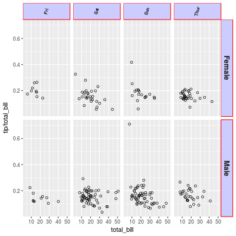

## 关于EDA相关笔记
 * [ROC解释](#Roc)
 
 * [R帮助查询](#R帮助文档使用)

 * [数据录入及修改](#数据输入)

 * [缺失值表示](#缺失值表示)

 * [查看数据](#数据体现)

 * [调整标签背景](#调整标签背景)

 * [调整图形颜色](#图形颜色调整)

 * [防止因去除部分值对图形影响](#coor_cartesian方法使用)

### ROC

ROC is a visual way for inspecting the performance of a binary classifier (0/1). In particular, it's comparing the rate at which your classifier is making correct predictions (True Positives or TP) and the rate at which your classifier is making false alarms (False Positives or FP). When talking about True Positive Rate (TPR) or False Positive Rate (FPR) we're referring to the definitions below:

	TPR=TruePositives/(TruePositives+FalseNegatives)
	FPR=FalsePositives/(FalsePositives+TrueNegatives)
	
* TPR：在所有實際為陽性的樣本中，被正確地判斷為陽性之比率
* FPR：在所有實際為阴性的样本中，被錯誤地判斷為陽性之比率。


### R帮助文档使用
1. 函数帮助查询 查询函数相关说明——使用方法如下

	```R
	?function_name
	help.start()   # general help
	help(foo)      # help about function foo 
	apropos("foo") # list all functions containing string foo
	example(foo)   # show an example of function foo
	
	```
2. Google及其他资源使用 
	* [R快速入门](http://www.statmethods.net/)
	* [R Cookbook](http://www.cookbook-r.com/)
	* [R Bloggers](http://www.r-bloggers.com/)
	* [StackOverflow 上的 R 语言简介](http://stackoverflow.com/tags/r/info)
	* [StackOverflow R 常见问题解答](http://stackoverflow.com/questions/tagged/r-faq%20)
	* [Google R Style Guid](https://google.github.io/styleguide/Rguide.xml)

### 数据输入
R数据输入可以通过read方法录入，另外如果需要对数据进行键盘操作，可以使用命令edit

```R
	 #From A Comma Delimited Text File
	mydata <- read.table("c:/mydata.csv", header=TRUE, sep=",", row.names="id")
	# read in the first worksheet from the workbook myexcel.xlsx
	# first row contains variable names
	library(xlsx)
	mydata <- read.xlsx("c:/myexcel.xlsx", 1)
	
	# read in the worksheet named mysheet
	mydata <- read.xlsx("c:/myexcel.xlsx", sheetName = "mysheet")
	
	#From SPSS
	# save SPSS dataset in trasport format
	get file='c:\mydata.sav'.
	export outfile='c:\mydata.por'. 
	
	# in R ——library a package
	library(Hmisc)
	mydata <- spss.get("c:/mydata.por", use.value.labels=TRUE)
	# last option converts value labels to R factors
	
	# From SAS
	# save SAS dataset in trasport format
	libname out xport 'c:/mydata.xpt';
	data out.mydata;
	set sasuser.mydata;
	run;
	
	# in R ——library a package 
	library(Hmisc)
	mydata <- sasxport.get("c:/mydata.xpt")
	# character variables are converted to R factors
	
	# From systat
	# input Systat file
	library(foreign)
	mydata <- read.systat("c:/mydata.dta")
```
创建数据名称后，使用edit进行编辑数据：

```R
	# enter data using editor 
	mydata <- data.frame(age=numeric(0), gender=character(0), weight=numeric(0))
	mydata <- edit(mydata)
	# note that without the assignment in the line above, 
	# the edits are not saved!
```

### 缺失值表示
In R, missing values are represented by the symbol NA (not available). Impossible values (e.g., dividing by zero) are represented by the symbol NaN (not a number). Unlike SAS, R uses the same symbol for character and numeric data.

### 数据体现
首先最重要的目标是了解数据，以及能够从数据中了解可以反映出什么问题，需要使用哪些相关数据以及如何体现。因此需要从单变量的方式中去了解数据。


### 调整标签背景
颜色调整可以通过theme来调入参数来调整。

```R
sp + facet_grid(sex ~ day) +
    theme(strip.text.x = element_text(size=8, angle=75),
          strip.text.y = element_text(size=12, face="bold"),
          strip.background = element_rect(colour="red", fill="#CCCCFF"))
```

**效果图如下**



### 图形颜色调整
调整图形颜色，可以通过color和fill参数来调整，color针对的是图形轮廓颜色，而fill是针对的图像区域内的颜色

```r
ggplot(aes(x = tenure), data = pf) + 
   geom_histogram(binwidth = 30, color = 'black', fill = '#099DD9')
```
### coord_cartesian方法使用
在使用ylim、xlim以及其他时候使用limits参数的时候，会引起某些值变化导致图形变化——例如在盒须图中，会因为去除了一部分值而导致IQR的值变化，引起图形变化。为了避免因为这种方式引起的图形变化，可以使用coor_cartesian方法：

```{r}
#取y轴的范围为0到1000
coor_cartesian(ylim=c(0,1000)) 
```
