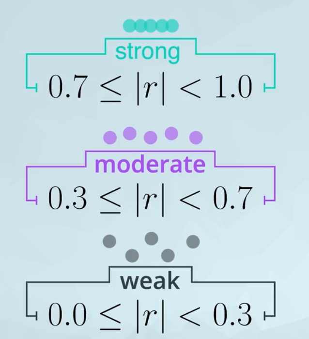

**目录**

[TOC]


课程中不论线性回归还是逻辑回归，这都是监督式学习的范畴：

1. 线性回归应用——包括简单线性回归和多元线性回归
2. 线性回归原理 
3. `Python` 中的应用
4. 回归的优缺点

## 1. 线性回归

线性回归，是利用给定的解释变量，通过建立线性关系确认新的反应变量。

* 反应变量（**Response Variable**）：即因变量（**Dependent Variable**）是需要预测的变量。例如房屋预测中房屋价格
* 解释变量（**Explanatory Variable**）：即自变量（**Independent Variable**）是用于预测的变量。例如房屋价格预测中房屋相关变量

在构建的线性关系中，评价两种变量之间的关系常用 **相关系数（Correlation Coefficient）** （常用皮尔逊相关系数，符号为 $r$，取值范围 $r\in[-1,1]$） 来解释，而在可视化方面可以使用散点图作为可视化工具。需要注意💰💰相关系数具有强弱性（相关系数绝对值越大，相关性越强）和方向性（正相关和负相关），此外相关系数和斜率之间 **没有必然关系**，如下图：


相关系数在强弱性上的一般判断标准：



### 1.1 线性回归回归线建立

线性回归的一般模型函数为 $\hat{y}=b_0+b_1x$ 或者 $\hat{y} = \beta_0+\beta_1x$，这个模型包括了一般参数：

* $\hat{y}$：即根据解释变量和回归线得到的预测值
* $b_0$ 或者 $\beta_0$：即截距，表示的是当 $x$ 为 0 的情况下，反应变量的预测值
* $b_1$ 或者 $\beta_1$：即斜率，表示 $x$ 解释变量每增加一个单位引起的反应变量的预测变化
* $x$：即解释变量
* $y$：是解释变量对应的实际反应值

最小二乘回归（**Ordinary Least Squares(OLS) Resgress**）建立线性回归的原理，即需要通过回归线得到的预测反应变量值和实际反应变量值差值最下，则可得到较优的线性回归线—— $min\big(\displaystyle{\sum_{i=1}^n(y_i-\hat{y_i})^2} \big)$ 

### 1.2 使用 Python 实现最小二乘法

在 Python 中可以通过 `statsmodels` 模块来拟合模型：

```python
# 加载包，sm 下面包括了 OLS 方法可以执行最小二乘法
import statsmodels.api as sm

# 构建变量模型及其拟合
lm = sm.OLS(y, X) 		# 这里的 X 可以是一个多维度数据，例如 df[["intercept", "area"]] 包括了截距和面积两个变量

result = lm.fit()

# 获取最终的拟合模型报告
print(result.summary())
```

在试试模型时，一般情况下都是需要手动添加截距项——添加了一个常数 1， 它在模型中的作用时能够帮助降低残差$^{[2,3]}$。


### 1.3 线性回归模型解释

* `coef`：对应变量名的参数
* `std err`：标准误差
* `t`：统计检验值
* `P>|t|` ：这个是对应的 `p` 值，它是基于参数值是否为 0 的零假设检验，用于说明特定变量是否有利于预测反应变量，即体现了哪个参数更重要
* `R-squared` ：即决定系数，它是相关系数的平方。作用是说明模型拟合度——解释变量中占据了多少百分比可以解释反应变量，用另一种方式表达就是有多少百分比的变异性，值的范围是 $[0, 1]$ 

### 1.4 多元线性模型建立

多元线性回归是针对多个解释变量来分析和解决问题。其模型上和简单的模型回归参数意义没有差别，但是需要注意符号存在差异 $\hat{y} = \beta_0 + \beta\bold X$，其中 $\bold X$ 是多变量的输入矩阵，$\beta$ 对应多变量的参数——它的推导公式 $\beta=(\bold X^{'} \bold X)^{-1}\bold X^{'}y$

### 1.5 Python 实现多元线性模型

在 Python 中也可以通过 `statsmodels` 模块来拟合模型：

```python
# 加载包，sm 下面包括了 OLS 方法可以执行最小二乘法
import statsmodels.api as sm

# 构建变量模型及其拟合，这里的 X 可以是一个多维度数据，例如 df[["intercept", "area", "bedroom", "bathroom"]] 包括了除了截距意外还有 3 个变量
lm = sm.OLS(y, X) 		

result = lm.fit()

# 获取最终的拟合模型报告
result.summary()
```

### 1.6 多元线性回归解释

统计学结果解释基本上都是相同的，但是需要注意解释 `coef` 时，对独立的解释变量解释需要强调**“在其它变量不变的情况下”**。需要注意一下，单变量关系显著，同样的变量在多变量中未必是显著的。另外还需要注意，分类变量的解释需要和基准变量进行参照比较分析

### 1.7 线性回归之分类变量

实际应用的情况下，可能会经常遇到数据是分类变量类型。这类变量是难以直接将数据应用到线性回归中的，在这类情况下需要将变量进行虚拟变量处理——将对应的值变量化得到 0 或者 1 的值。在得到处理的变量之后，添加的变量数量是分类数量减一——这样的作用是得到满秩矩阵一方便矩阵求逆。

### 1.8 线性模型潜在问题假设及其解决办法

五个主要的问题：

1. 因变量-自变量关系的非线性
2. 误差项的相关性
3. 非恒定方差和正态分布误差
4. 异常值/高杠杆点
5. 共线性

本文总结了上述问题判断方法以及其解决办法。这是统计学家面试时经常提出的问题，但该问题是否有实际意义取决于你创建模型的目的。在接下来的概念中，我们会更仔细地研究某些相关知识点，因为我觉得我们需要额外注意那些，但下方为你列出了各知识点的详尽介绍，我们先来仔细看看下文涉及的每一项。

#### 1.8.1 线性

线性是假设因变量和自变量之间真的存在可用线性模型解释的关系。如果线性假设不为真，那你的预测结果就不会很准确，此外，与系数有关的线性关系也就没什么用了。

为了评估某段线性关系是否合理，一个很实用的方法是做预测值 $(\hat{y})$ 的残差图。如果图中出现多个曲线部分，那就意味着线性模型实际上可能并不拟合数据，自变量和因变量存在其它关系。创建非线性模型的办法有很多（甚至可以线性模型的形式来创建），其中几种办法会在本课后面的内容中提及。

下图是 **偏差模型（Biased Model）**，图片左上角残差图为随机散点，它是最理想的情况。


#### 1.8.2 相关误差

对于随时间变化来收集的数据（比如预测未来股价或利率），或数据与空间有关（如预测洪涝或干旱地区），那就很容易出现相关误差。可以用过去数据点提供的信息（针对与时间有关的数据）或用相邻数据点提供的信息（针对与空间有关的数据）来提高预测结果。

不考虑相关误差的主要问题，是因为通常需要利用这一相关性来得到更好的未来事件预测数据或空间关联事件预测数据。

要判断是否有相关误差，最常用的方法是观察收集数据的域。如果不确定的话，可以试试一个叫 [Durbin-Watson](https://en.wikipedia.org/wiki/Durbin%E2%80%93Watson_statistic) 的检验方法，人们常用该测试来评估误差相关性是否造成问题。以及 [ARIMA 或 ARMA](http://www.statsref.com/HTML/index.html?arima.html) 模型，人们常用这两个模型来利用误差相关性，以便做出更佳预测。

#### 1.8.3 非恒定方差和正态分布误差

当预测的值不同，得到的预测值范围也不同，那就意味着方差不恒定。非恒定方差对预测好坏影响不大，但会导致置信区间和 p 值不准确。在预测值接近实际值的那部分区域，系数的置信区间会太宽泛，而在预测值较远离实际值的区域则会太窄。

通常来说，对数函数（或对反应变量使用其他变换方式）能够 “摆脱” 非恒定方差。如果选择合适的变换方式，一般会用 [Box-Cox](http://www.statisticshowto.com/box-cox-transformation/)。

用预测值的残差图也可以评估非恒定方差。上面的图中非恒定方差的标签为 **异方差（heteroscedastic）**。理想情况下，要的是一个有异方差残差的无偏模型（**unbiased model with homoscedastic residuals **）——其异方差残差在一定数值范围内保持不变。

虽然本文并不探讨残差的正态性，如果要创建可靠的置信区间，正态性回归假设就十分重要了，更多相关信息详见 [Are the model residuals well-behaved?](https://www.itl.nist.gov/div898/handbook/pri/section2/pri24.htm) 。

#### 1.8.4 异常值（Outliers/Leverage Points）

异常值和杠杆点是远离数据正常趋势的点，这些点会对结果造成很大的影响。实际情况下，这些点甚至可能是错误的。如果收集数据源不同，可能在记录或收集过程中存在的错误数据。

异常值也可能是准确真实的数据点，而不一定是测量或数据输入错误。在这种情况下，'修复'就会变得更为主观。要如何处理这些异常值往往取决于分析目的。线性模型，特别是使用最小二乘法的线性模型，比较容易受到影响，也就是说，大异常值可能会大幅度地影响结果。当然，异常值也有一些解决技巧，也就是我们常说的 **正则化**。

而在宾夕法尼亚州立大学提供的完整回归课程里，就有特别长的篇幅在探讨异常值的问题，详见[ Influential Points | STAT 501](https://onlinecourses.science.psu.edu/stat501/node/336/) 。

#### 1.8.5 共线性（多重共线性）

如果自变量彼此相关，就会出现多重共线性。多重共线性的一个主要问题在于：它会导致简单线性回归系数偏离我们想要的方向。

要判断是否有多重共线性，最常见的办法是借助散点图或 **方差膨胀因子 (即 variance inflation factors,  VIFs)**，参考[Variance Inflation Factor (VIF) Explained - Python](https://etav.github.io/python/vif_factor_python.html) 。在实际应用中，`VIF` （对应某个变量计算公式是 $\rm VIF_i=\frac{1}{1-R_i^2}$，其中 $R_i$ 是排除了 $x_i$ 变量之后的其他所有变量的值）大于 10 ，那说明模型可能出现多重共线性

```python
# 使用了 seaborn 中的 pairplot 方法来进行可视化显示双变量关系
import seaborn as sns

sns.pairplot(df[["area", "bedroom", "bathroom"]])

# 计算 VIF 需要使用 statsmodel 包
from statsmodels.stats.outliers_influence import variance_inflation_factor
from patsy import dmatrices		# 这个方便数据处理

# 首先需要对数据进行筛选，注意截距数据不用添加
y, X = dmatrices('price ~ area + bedrooms + bathrooms', df, return_type='dataframe')
vif = pd.DataFrame()
# 使用 variance_inflation_factor 来计算 VIF，并将值赋给 dataframe 中的列
vif["VIF Factor"] = [variance_inflation_factor(X.values, i) for i in range(X.shape[1])] 
vif["features"] = X.columns
```

### 1.9 逻辑回归

它解决的是预测分类变量的问题，特别是二分类的问题——是否信用欺诈，得到的反应变量结果是 0 或 1 。数学模型是 **Sigmoid** 函数， $S(x)=\frac{1}{1+e^{-x}}$。而在实际应用层面上，模型是一个复合函数，$。P(Y=1|x)=F(g(x))=\frac{1}{1+e^{-(b_0+b_1*x)}}$通过数学方式转换可以转换为一个“线性模型”， $\ln(\frac{p}{1-p})=b_0+b_1x+\epsilon$，这样就转换为了一个自然对数的 **机会比(Odds Ratio)($\frac{p}{1-p}$)**。需要注意⚠️ $b_1$ 参数表示的是随着 $x$ 变化，**log-odds ratio** 的变化率——即是 **log-odds** 的斜率，而非概率的斜率。


> 最小二乘法不适用于二分类问题，因为预测的结果是 $0$ 或者 $1$，预测得到的概率是小于 0 或者大于 1 的，这样导致概率没有意义。因此需要使用逻辑回归模型，这样得到的概率值就是在 $0\%$ 和 $100\%$ 之间以此来确认结果属于哪个类别

在 Python 实现模式上和数据处理上，和多元回归是一样的

### 1.10 逻辑回归解释

**在其他变量保持不变的情况下** 对应的解释变量每增加一单位，结果就是某个分类变量的系数指数发生变化倍数。 $b_1$ 参数表示的是随着 $x$ 变化，**log-odds ratio** 的变化率——即是 **log-odds** 的斜率，而非概率的斜率。其他的统计学结果解释和其他回归相同。

### 1.11 逻辑回归的评估

参考[混淆矩阵](http://scikit-learn.org/stable/modules/generated/sklearn.metrics.confusion_matrix.html) 及其解释

## 参考

1. [几种常见相关系数- Statistics Solutions](http://www.statisticssolutions.com/correlation-pearson-kendall-spearman/)

   * [皮尔逊相关系数](https://en.wikipedia.org/wiki/Pearson_correlation_coefficient)  可以很像线性关系的方向性和强弱性 $r=\frac{cov(X, Y)}{\sigma_x\sigma_y}$
   * [斯皮尔曼等相关系数](https://zh.wikipedia.org/wiki/%E6%96%AF%E7%9A%AE%E5%B0%94%E6%9B%BC%E7%AD%89%E7%BA%A7%E7%9B%B8%E5%85%B3%E7%B3%BB%E6%95%B0)  不只用于很像线性关系，更是适用于关联两个变量的场合，是衡量两个变量的依赖性的非参数指标 $\rho=\frac{\sum_i(x_i-\bar{x})(y_i-\bar{y})}{\sqrt{\sum_i(x_i-\bar{x})^2\sum_i(y_i-\bar{y})^2}}$ 

2. [Statcon: Why we need the intercept](http://statistiksoftware.blogspot.com/2013/01/why-we-need-intercept.html) 

3. [When is it ok to remove the intercept in a linear regression model? - Cross Validated](https://stats.stackexchange.com/questions/7948/when-is-it-ok-to-remove-the-intercept-in-a-linear-regression-model)

4. [R-squared 无用？](http://data.library.virginia.edu/is-r-squared-useless/)

5. 多元线性回归存在的潜在问题

   1. 模型是为了了解解释变量和反应变量之间的相关性——潜在问题是反应变量和解释变量之间可能不存在线性关系；可能具有相关性误差；可能具有误差的常数方差；具有离群值和杠杆点；具有多重共线性
   2. 模型是为了预测反应变量
   3. 说明解释变量对反应变量之间的关系

6. 高阶项

   高阶项是针对某些变量在回归中表现出的非线形关系，但是可以使用通过平方、立方等以及交叉相乘的方式得到的高阶项来进行线性回归。确定高阶项的幂数，比较简单的方式是观察解释变量和反应变量的图形中曲线个数。在 Python 处理数据的话，得到高阶项的方式可以直接将变量相乘。实际处理应用参考[So What? | Open Mind](https://tamino.wordpress.com/2011/03/31/so-what/) 

   

   交叉项的解释，是两个变量之一和反应变量的关系。这样处理的变量是因为两个变量之间存在不一致的斜率，可以转化达到一致。