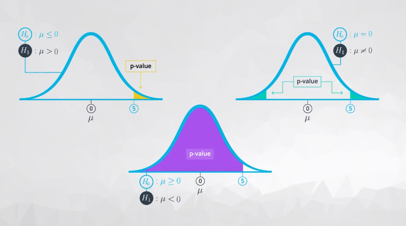

**目录**

[TOC]

这部分内容设计到推论统计学相关内容，包括了假设检验以及置信区间相关内容。

## 1. 假设检验

假设检验，首当其冲就是**提出假设**——将实际问题转换为可判断的假设；之后需要 **收集和验证数据**。而对验证过程和结果的有效性，需要依赖于有效的检验方法，包括置信区间；其中结果的分析需要选择合适的分析指标（**Metrics**）。

### 1.1 提出假设

提出假设，包括两个方面的内容：

1. **零假设/原假设（Null Hypothesis）**

   表示符号是 $\rm H_0$；其提出的零假设一般是针对两个测量的现象是没有相关性的，或者是检验的样本和总体之间没有相关性。这里需要强调💰💰一点，整个假设检验中零假设是才是用于描述统计学显著性检验的语句，而且显著性检验的设计也是最终是否拒绝零假设 $^{[1]}$，也就是说在统计检验之前的假设中一般是默认选择零假设。

   在描述上，零假设一般常用描述“没有效果”或者“没有差异”——但是在没有进行数据验证之前，$H_0$ 是为真的，换句话来说就是按照 ”无罪推定“ 的方式来验证它。描述方式：$=$，$\le$，$\ge$

2. **对立假设/备选假设（Alternative Hypothesis）**

   表示符号是 $\rm H_1$ 或者 $\rm H_a$；它是和零假设的内容完全对立的假设。描述方式：$\ne$，$\lt$，$\gt$

3. 两者关系

   是竞争性、非重叠性的假设

假设检验的重点和难点，检验的过程是通过样本数据进行推测总体情况——数据源来看用到的数据是样本数据，通过样本数据分析显著性情况来判断总体情况是怎么样的（样本数据的统计中是明确的），举例说明：检验地区之间人口年龄分布情况，需要分析两个地区之间人口年龄分布是否一致——抽取数据是地区内的样本（只是部分数据），而验证的是两个总体之间是否一致（一个地区总体与另一个地区总体之间的关系）；另一个例子，验证罐装水的是否符合它标识的容量，这里抽取罐装水的数据（这里就是样本）。验证抽取的样本数据是否符合它的标识容量（标识容量被当作了总体的参数）——这样的目的就似验证抽取的样本是否来自于总体。由以上信息提出相关的假设语句：
$$
\begin{align}
two\_sided\_test/two\_tailed\_test &\ \ \ \  H_0:\ \ \ \mu_1=\mu_2 &\ \ \ \ H_1:&\ \ \ \  \mu_1 \ne \mu_2 \\
one\_sided\_test/one\_tailed\_test &\ \ \ \  H_0:\ \ \ \mu_1 \le \mu_2&\ \ \ \ H_1:&\ \ \ \ \mu_1 \gt \mu_2 \\
one\_sided\_test/one\_tailed\_test &\ \ \ \  H_0:\ \ \ \mu_1 \ge \mu_2&\ \ \ \ H_1:&\ \ \ \ \mu_1 \lt \mu_2 \\
\end{align}
$$

### 1.2 混淆矩阵与错误类型

基于对检验结果（**Positive** 和 **Negative**）能否接受或拒绝零假设，和实际情况（**True** 和 **False**）中是否成立。如果检验结果能够接受零假设，那么结果是 **Positive**，反之则是检验结果拒绝接收零假设，那么结果是 **Negative**。在实际情况下事件描述是真实的那么即为 **True**，反之则为 **False**。这样就构成了混淆矩阵：

|                         |                |                  Actual Condition                  |                  Actual Condition                   |
| ----------------------- | -------------- | :------------------------------------------------: | :-------------------------------------------------: |
|                         |                |                     $H_0$ True                     |                     $H_0$ False                     |
| **Predicted Condition** | $H_0$ Positive |                   True Positive;                   | False Positive; Type $\rm II$ Error; $\beta$  Error |
| **Predicted Condition** | $H_0$ Negative | True Negative; Type $\rm I$  Error; $\alpha$ Error |                False Negatie; Power                 |

举个识别图片中是否为猫的例子，首先提出一个零假设——图片中对象是猫。接下来假设检验的结果，验证结论是图片是猫，这符合零假设那么结论就是 **Positive**；反之验证结论是图片是猫不可接受，那么就是不符合零假设结论就是 **Negative**。在实际情况方面，如果进行实际检查图片它确实是猫，那么实际的结论就是 **True**；反之实际的图片不是猫，那么结论就是 **False**。

统计检验包括了两种类型错误：

* 第一类错误（**Type $\rm I$ Error**）

  第一类错误又被称为真阴性（**True Negative**），表现上就是实际为真但是预测结果为负的情况。使用上面图像识别的例子就是，一个图片它实际上是猫，但是预测的结果上它不是猫，这样就构成的第一类错误。这个的条件性概率表述方式就是 $P\big(reject\ null\ hypothesis|true\ null\ hypothesis\big)$ 的概率，这里的概率表述方式就是显著性水平（$\alpha$）的表达。显著性水平对立的面就是置信水平，两者的数学关系为 $\rm confidence\ level=1-\alpha$

* 第二类错误（**Type $\rm II$ Error**)

  第二类错误又被称为假阳性（**False Positive**），表现上就是实际为假但是预测结果为正的情况。同样以图像识别的例子来说明，一个图片实际上不是猫，但是预测结果上它是猫，这样就构成的第二类错误。用条件概率的表示就是 $P\big(not\ reject\ null\ hypothesis|false\ null\ hypothesis \big)$，这里的概率表达式就是 $\beta$ 的表述。$\beta$ 和效用（**Power**）存在数学关系：$\rm power=1-\beta$

* 两者关系

  第一类错误在表现上似 **误报**，第二类错误表现上似 **漏报**。在统计学检验过程中，为了降低某类错误而单一地调整某个数据，可能会导致另一类错误出现几率增大${^{[2]}}$。

### 1.3 假设检验应用

当明确了检验假设之后，就需要使用数据来确认假设的正确性。在进行确认假设的正确性过程中，有两种常用的方法$^{[5]}$：

* 对样本数据进行模拟抽样分布，以此来观察假设的情况是否与抽样分布中观察到的结果一致。此种方法就是利用置信区间进行分析。使用自助法（**Bootstrap**）对样本数据进行大量抽样，以此模拟置信区间的上下界，检查零假设和置信区间的关系以此判断假设正确与否。相关步骤如下：

  1. 首先确立假设

     $\rm H_0: \mu \le 70$

     $\rm H_1: \mu \gt 70$

  2. 自助法抽样，反复计算得到的样本均值。以均值建立一个抽样分布及其对应的置信区间，以此检验总体均值的合理性

     ```python
     # 首先进行自助法抽样，计算样本均值
     means = []
     for _ in range(10000):
     	bootsample = sample_df.sample(150, replace=True)	# ⚠️这里是有放回的抽样
     	means.append(bootsample.mean())
     
     lower_bound, upper_bound = np.percentile(means, 5), np.percentile(means, 95) 	# 这里得到了样本的置信区间的上下界
     ```

  3. 将零假设和计算得到的置信区间上下界进行比较，判断零假设是否正确

  

* 通过选择零假设来模拟出现的情况，是否和样本数据一致。在进行的步骤中，首先假定零假设为真；以此使用对立假设的最接近值（同时需要它属于零假设的空间）来模拟分布情况，使用抽样分布的标准偏差来确认如果这个值来自于零假设时抽样分布

  1. 首先确立假设，同时假定零假设为真

     $\rm H_0:\mu \le 70$

     $\rm H_1: \mu \gt 70$

  2. 使用零假设里最接近对立假设的值进行模拟，以此可以知道抽样分布的形状。最后的模拟正态分布抽样，需要使用  [numpy.random.normal](https://docs.scipy.org/doc/numpy-1.14.0/reference/generated/numpy.random.normal.html) 

     ```python
     # 上面的最接近对立假设值为 70，同时属于零假设的空间值
     
     # 计算出抽样样本的标准偏差
     means = []
     for _ in range(10000):
     	bootsample = sample_df.sample(150, replace=True)
     	means.append(bootsample["height"].mean())
     	
     std = np.std(means)
     
     # 接下来我需要知道均值为 70，样本标准偏差是 std 的情况下，样本的分布情况
     null_vals = np.random.normal(70, std, 10000)	# 这里使用自助法相同的抽样次数
     
     # 最后可以通过上面的 null_vals 来得到样本分布图
     plt.hist(null_vals)
     ```

  3. 最后需要将样本数据的平均值和得到的抽样分布数值进行比较

     ```python
     # 计算样本的均值
     sample_df["height"].mean()
     
     # 通过得到的样本均值和分布状态的比较，最终得出结论样本均值是否来自于零假设值
     ```


#### 1.3.1 模拟零假设练习解析——12.15 Notebook+ 练习：模拟零假设

如果你想知道喝咖啡的人的平均身高是否与不喝咖啡的人的平均身高相等

第一个难点是怎么对数据进行自助法获取样本，这里的方法是使用 `groupby` 方法或者聚类数据，计算其平均值。解题难点提示

```python
sample_data.groupby("drinks_coffee")["height"].mean()

# output
drinks_coffee
False    66.784923
True     68.119630
Name: height, dtype: float64
```

上面选择了其中一次抽样的计算两种条件下人员的平均身高

### 2. `p` 值

定义：如果假设为真，观察到统计量 (或更多极端样本支持备择假设) 的概率。`p` 值的分布情况，和整个假设的关系图：



结合上面的假设检验中的第二种方法，如果通过 `sample_df["height"].mean()` 计算出的统计值是远离分布区域（这里值前面绘制的 `null_vals` 直方图分布图），那么就是说明零假设的总体情况是不可能得到样本统计量。结合上面的图示，如果要通过 `Python` 来计算 `p` 值，需要结合条件判断来选用何种方式抛弃零假设来计算比例以得到 `p` 值。

#### 2.1 `p` 值计算步骤

**这里有疑问在 1 分 27 秒左右，进行了最后一步可视化步骤的作用，没有明白统计检验的意义**

```python
# 1. 模拟零假设中得出统计量的数值
means = []
for _ in range(10000):
	bootsample = sample_df.sample(150, replace=True)
	means.append(bootsample["height"].mean())
	
std = np.std(means)

null_vals = np.random.normal(70, std, 10000)

# 2. 计算你实际从数据中得到统计量的数值
sample_mean = sample_df["height"].mean()

# 3. 对比统计量和零假设中的数值
(null_vals > sample_mean).mean()	# 这里的比较符合，可以简化通过类比对立假设来确认

# 4. 根据备择假设，计算被视为极端空值的比例——这里使用的是直方图显示，显示的是最低值为 sample_mean，最高值为 null_mean + (null_mean - sample_mean)
low = sample_mean
high = null_mean + (null_mean - sample_mean)

plt.hist(null_vals)		# 显示出零假设的分布情况
plt.axvline(x=low, color="r", linewidth=2)
plt.axvline(x=high, color="r", linewidth=2)		# 这里的情况会显示是否有极端情况，即小于 low 大于 high 的数据点
```

#### 2.2 `p` 值和临界值（**Critical Value**）实际应用

临界值是确定检验统计量的值是否小到足以拒绝原假设的一个基准 $^{[6]}$。注意⚠️临界值需要根据显著性水平以及检验方法来确认临界值是多少。

这里涉及到两种检验方法：

1. `p` 值检验法：利用统计检验方法，计算出统计检验值和 `p` 值。之后以这个 `p` 值和显著性水平值进行比较确认是否拒绝原假设
2. 临界值法：通过显著性水平以及相应的统计学检验方法，确认临界值。根据计算的统计检验值和临界值比较确认是否拒绝原假设

### 3. 统计检验中的其他因素

#### 3.1 样本选择

 在样本选择时需要考虑样本代表性问题，避免”驴唇对马嘴“的情况，这样得出的结论不能正确代表总体情况；同时样本规模的影响，对于样本规模增大，统计显著性会增强。

下面是针对样本规模过大，对统计显著性的影响：

假设你在一项针对 100 多万人的研究中发现 **从统计学上来说** 更多人喜欢啤酒 1，而不是啤酒 2。根据这个结果，你决定开店售卖啤酒 1。然后你发现啤酒 1 的流行度只比啤酒 2 高出 0.0002% (但是在样本容量很大的情况中，这个具有统计意义)。实际上，你应该开店售卖两种啤酒。

#### 3.2 多重假设检验（Multiple Hypothesis Test）校正

当进行[多重比较](https://en.wikipedia.org/wiki/Multiple_comparisons_problem) 时，会因为[族错误率](https://en.wikipedia.org/wiki/Family-wise_error_rate) 导致显著性增强。为了控制这种符合 $\rm I$ 类错误而进行校正：

1. 邦弗朗尼校正法（**Bonferroni correction**）例如非相关的多个指标增加了最后结论的显著性或者使用了多个假设试验时，将显著性水平除以指标个数或者假设试验次数，以降低单个指标的显著性水平。但是该方法可能导致分析结果过于保守——对相关性指标不建议使用$^{[7]}$。

##### 下面这两个是一个坑，需要自己填

1. 图基校正（**Tukey's method**）[7.4.7.1. Tukey's method](https://www.itl.nist.gov/div898/handbook/prc/section4/prc471.htm)
2. [Q 值](http://www.nonlinear.com/support/progenesis/comet/faq/v2.0/pq-values.aspx) 常用于医学方面

#### 3.3 确定置信水平、显著性水平以及 $\rm I$ 类错误概率等信息解读

显著性水平： $\alpha$

置信水平： $\rm CL$，即 $\rm Confidence\ Level$

置信区间：$\rm CI$，即 $\rm Confidence\ Interval$

以上几者的关系：
$$
\begin{align}
two\_sided\_test/two\_tailed\_test &\ \ \ \  \alpha = \rm 1-CL \Longleftrightarrow CI 对应概率区间 \in [\frac{\alpha}{2}, CL+\frac{\alpha}{2}]\\
left\_sided\_test/left\_tailed\_test &\ \ \ \  \alpha =\rm 1- CL \Longleftrightarrow CI 对应概率区间 \in [\alpha,+\infin)\\
right\_sided\_test/right\_tailed\_test &\ \ \ \  \alpha =\rm 1- CL \Longleftrightarrow CI 对应概率区间 \in (+\infin, 1-\alpha]\\
\end{align}
$$

#### 3.4 第一个练习解释

1. 第一问和第二问

   在进行的练习的时候，需要注意总体和样本数据区分。总体是整个数据集的数据，而样本是抽样的数据。5 个数的平均值数抽样分布，重点是需要对抽取的样本进行自助法抽样得到分布情况

2. 第三问

   这里需要的使用 `p` 值检验的方式，即需要先使用总体均值和样本标准偏差模拟出零假设数据分布，使用这个零假设数据和样本均值比较比例

3. 第四问到第六问

   这里是重复上面的过程，目的是验证抽烟样本大小变化对统计学结论的影响

#### 3.5 第二个练习

这里需要理解的校正方法，模拟的试验次数以及 `p` 值检验方法说明

```python
# 这里创建了一个显著性水平比较
df["test"] = df["pvalue"].apply(lambda x: 1 if x < 0.05 else 0)

# 下面是对 p 值检验计算出一类错误概率——实际为假，但是得出的结果是正面的比例
df.groupby("actual")["test"].mean()
```


1. 测试总体平均数 [(单样本 t 检验)](https://www.cliffsnotes.com/study-guides/statistics/univariate-inferential-tests/one-sample-t-test)。
2. 测试均数差 [(双样本 t 检验)](http://www.itl.nist.gov/div898/handbook/eda/section3/eda353.htm)
3. 测试个体治疗前后的差异 [(配对 t 检验)](http://www.statstutor.ac.uk/resources/uploaded/paired-t-test.pdf)
4. 测试总体比例 [(单样本 z 检验)](https://stattrek.com/statistics/dictionary.aspx?definition=one-sample%20z-test)
5. 测试总体比例的差异 [(双样本 z 检验)](https://onlinecourses.science.psu.edu/stat414/node/268)

 

## 参考

1. [Null hypothesis - Wikipedia](https://en.wikipedia.org/wiki/Null_hypothesis#Basic_definitions) 

   囊括了零假设的整个脉络内容，对于理解概念非常重要

2. [Understanding Statistical Power and Significance Testing 6](http://rpsychologist.com/d3/NHST/)

   可视化的展现了两类错误之间存在的关系以及样本容量对统计学分析的时候，对显著性分析，统计功效的影响。

3. [第一型及第二型錯誤 - 维基百科，自由的百科全书](https://zh.wikipedia.org/wiki/%E7%AC%AC%E4%B8%80%E5%9E%8B%E5%8F%8A%E7%AC%AC%E4%BA%8C%E5%9E%8B%E9%8C%AF%E8%AA%A4)

4. **Bootstrap** 法和有放回抽样的异同

   两者在方法上都进行重采样的方法。但是自助法抽样是进行的 **有放回地全抽**——自助法抽取的样本量和原样本样本量相同。用 `Python` 代码进行如下解释：

   ```python
   # 一般的有放回抽样，对数据 data 进行有放回抽取 n 个样本
   data_sample = df.sample(n=n, replace=True)
   
   # 自助法是对抽取到的样本进行 z 次重复有放回的抽取 data_sample 中 n 个样本
   bootsample = []
   for _ in range(z):
   	bootsample.append(data_sample.sample(n=n, replace=True).mean())
   ```

   它用这种方法得到了样本分布，依据这个样本的离散程度情况来说明“基于样本结果来看，草原上的羊是黑色的”。更多详情参考 [Bootstrapping (statistics) - Wikipedia](https://en.wikipedia.org/wiki/Bootstrapping_(statistics))

5. [3.0 - Hypothesis Testing | Statistics](https://onlinecourses.science.psu.edu/statprogram/node/136/) 

6. [Critical Values: Find a Critical Value in Any Tail - Statistics How To](http://www.statisticshowto.com/probability-and-statistics/find-critical-values/) 

7. 相关性指标影响分析：

   ${P_{one\ significant\ result}=1-P_{non\ significant\ results}}$，其中 ${P_{non\ significant\ results}}$ 的计算需要结合指标个数： ${P_{non\ significant\ results}=(1-\alpha)^n}$ ，其中 ${n}$ 为指标个数