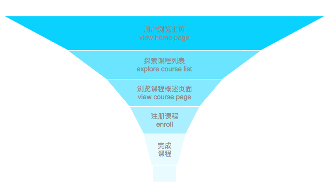

**目录**

[TOC]

本部分内容是针对 `A/B` 测试的案例研究和项目部分的内容

**AB 测试**就是为了验证在先验条件的存在的情况下，进行新的变更是否合理和可行以达到优化的目的。使用 AB 测试的方式能能够度量变更对某些指标的变化，是变更更具有合理性依据更充分。

AB 测试也存在 **不适用的场景**：1）对没有明确参照的试验，AB 测试是基于先验条件的优化，如果没有一个参照对比是无法进行测试。2）数据获取时间长，AB 测试一般都是进行小规模快速的试验，所以对于数据获取的单周期较长的试验不太适用。

影响测试效果的因素：1）**新奇效应**：即`Novelty Effect` 指老用户可能会觉得变化很新鲜，受变化吸引而偏爱新版本，哪怕从长远看来新版本并无益处。2）**抗拒改变心理**：即 `Change Aversion` 老用户可能会因为纯粹不喜欢改变而偏爱旧版本，哪怕从长远来看新版本更好。


## 1. 实施流程

### 1.1 `A/B` 测试的背景信息：

使用 `A/B` 测试帮一家公司决定公司网站要不要推出两个新元素。其中新用户注册流程（**浏览主页 > 探索课程 > 浏览课程概述页面 > 注册课程 > 完成课程**）呈现漏斗模型，随着流程深入整体用户数量减少



测试“漏斗”中不同点的变化，最终需要确定变更对用户的影响。

### 1.2 确定指标以及检验假设

在根据“漏斗”流程来理解分析指标作用，衡量指标是否可用。常用的指标：

* **点击率**：即 **Click Through Rate**，至少点击数量超过一次的唯一用户数量占浏览页面的单一用户数量的比例。一般用于探索用户对于页面的点击行为。唯一用户的统计，可以使用 `cookies` 来统计
* **注册率**：即 **Enrollment Rate**，课程概述页面的 ”Enroll“ 按钮的点击率
* **平均浏览时长**：即 **Average Reading Duration**，浏览课程页面的平均花费秒数
* **平均教室逗留时长**：即 **Average Classroom Time** 注册课程的学员，花费在教室的平均天数
* **完成率**：即 **Completion Rate** 注册课程学员的课程完成比例


测试是一个比较两个群体变化的统计学检验，因此该检验可以使用以下两种方式来提出假设：

1. 零假设：$\rm H_0:\pi_{new\ version}\le \pi_{old\ version}$ ；对立假设：$\rm H_1: \pi_{new\ version} \gt \pi_{old\ version}$
2. 零假设：$\rm H_0:\pi_{new\ version}-\pi_{old\ version} \le 0$ ；对立假设：$\rm H_1: \pi_{new\ version}-\pi_{old\ version} \gt 0$

### 1.3 检验分析——单一指标分析

思路是参考 `Bootstrap` 抽样和 `p` 值方法的思路。1）对样本进行抽样，计算出每轮抽样的差异作为每次数据点，并且创建了一个关于 **零假设分布模型**——即以 0 为均值，样本标准差来建立正态分布模型。2）分析 `p` 值得出最终的结论，计算零假设分布中大于观察差异的比例得到 `p` 值。结合统计显著性和 `p` 值确认结论。下面的示例是以 `CTR` 的角度来进行分析演示，这一类的方法主要是比率型指标；如果是针对分布型指标（例如平均值的计算），那么在计算 `bootstrap` 中抽样出计算平均值作为每轮数据点：

```python
# 需要 bootstrap 抽样进行获取数据，需要删除重复 id
diffs = []

for _ in range(int(1e4)):
	sample = df.sample(df.shape[0], replace=True).drop_duplicates("id")
	diff = sample.query("action == 'enroll'").groupby(["group"]).size() / \
    	sample.query("action == 'view'").groupby(["group"]).size()
	
	diffs.append(diff["experiment"] - diff["control"])

# 创建零假设分布模型
null_vals = np.random.normal(0, np.std(diffs), len(diffs)) 	# 这里可以依据这个数据绘制条形图，查看分布
	
# 计算样本观察差异, 首先可以去除重复 id，以留下唯一的 id
df_unique = df.drop_duplicates("id")
obs_result = df_unique.query("action == 'enroll'").groupby(["group"]).size() / \
    df_unique.query("action == 'view'").groupby(["group"]).size()

obs_diff = obs_result["experiment"] - obs_result["control"]
# 使用观察差异值和分布数据进行比较，计算比例得到 p 值
(null_vals > obs_diff).mean()	# 这里的比较符号是通过对立假设确认的
```

### 1.4 检验分析——多指标分析

针对多指标或者多轮的多重比较时，需要注意显著性水平是否被放大。如果存在显著性水平放大，那么就需要注意使用相关的校正方法进行校正，例如 [Bonferroni 校正](http://en.wikipedia.org/wiki/Bonferroni_correction) 。同时，还需要注意考虑校正是否具有保守的问题，例如当多个指标之间并没有相关性（例如 `CTR` 和唯一用户数量之间即具有相关性），那么使用 `Bonferroni` 校正就存在过于保守的问题。

在对多指标分析方面，还有其他非保守性方法，如[封闭测试程序](http://en.wikipedia.org/wiki/Closed_testing_procedure)、 [Boole-Bonferroni 联合校正](http://en.wikipedia.org/wiki/Bonferroni_bound) 以及 [Holm-Bonferroni 方案](http://en.wikipedia.org/wiki/Holm%E2%80%93Bonferroni_method) 。同样在使用不同这些方法时，需要确认假设方案的正确性

### 1.5 得出结论

在完成统计分析之后，需要结合实际运营要求进行分析，是否有必要执行变更。


### 注意

在实际分析的过程中，需要注意试验的每一步过程是否合适。例如分析指标是否合适、试验分组是否合适、试验时长等方面

## 2. 练习解析

### 2.1 `CTR` 练习——6.练习：试验

单一用户数量：这个是统计单一 `id` 的数量，其中可以使用 `nunique` 方法来得到惟一值数量

统计对照组和试验组规模：这个是需要统计对照组和实验组中单一用户的数量，可以使用 `groupby` 方法进行分组聚合，选择 `id` 字段且使用 `nunique` 方法

试验持续时间：重点是需要将数据进行转换为日期类型（使用 `pd.to_datetime` 方法），确认最大值和最小值的差异

### 2.2 注册率练习——10.指标——注册率

* 计算注册率：注册课程的独一用户除以浏览课程的独一用户，可以直接利用`query` 筛选出特定的`action` 用户，使用 `groupby` 进行聚合计算比例

  ````python
  df.drop_duplicates("id").query("action == 'enroll'").groupby(["group"]).size() / \
      df.drop_duplicates("id").query("action == 'view'").groupby(["group"]).size()
  ````

* 绘制样本观察值：需要添加一条垂直的线，需要使用 `matplotlib` 中的 `axvline` 方法

  ```python
  plt.hist(null_vals)		# 绘制零假设分布
  plt.axvline(x=obs_diff)		# 添加一条垂直线条
  ```

  

## 参考

1. [p-hacking, or cheating on a p-value | Freakonometrics](https://freakonometrics.hypotheses.org/19817) 正确的测试方法，决策正确的基础